# 📊 2023 Employment Analytics Dashboard (Power BI)

> **An end-to-end Power BI project demonstrating data modeling, DAX problem-solving, and executive-ready data storytelling.**

---

## 🔍 Project Overview
This project analyzes **U.S. employment trends from May–July 2023**, with a focus on identifying sector-level outliers. Through iterative visual development and data modeling, the **Government sector** was identified as a significant deviation from broader economic patterns.

---

## 🎯 Business Question
**Which employment sector experienced abnormal short-term growth in mid-2023, and how did it compare to overall economic trends?**

---

## 🛠 Tools & Technologies
- Power BI Desktop  
- DAX (Calculated Columns)  
- Power Query (Data Cleaning)  
- Time-Series Analysis  
- Business Intelligence & Data Storytelling  

---

## 📁 Data Preparation & Modeling

### Problem: Month Sorting Error
Month values were stored as text (e.g., `June 2023 (p)`), which caused **alphabetical sorting** in visuals.

❌ June → July → May  
✅ May → June → July  

### Solution: DAX Helper Column
A calculated date column was created to enforce chronological sorting.

```DAX
MonthDATE = 
VAR CleanText = 
    TRIM(
        SUBSTITUTE('establishement_data'[Month], "(p)", "")
    )
VAR YearNum = 
    VALUE(RIGHT(CleanText, 4))
VAR MonthNum = 
    MONTH(
        DATEVALUE(
            LEFT(CleanText, 3) & " 01 2000"
        )
    )
RETURN
DATE(YearNum, MonthNum, 1)
```

The helper column was used with **Sort by Column** and then hidden for a clean data model.

---

## 🧱 Visual Development Process

### Data Import & Exploration
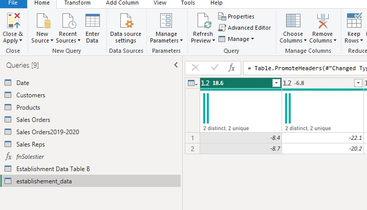
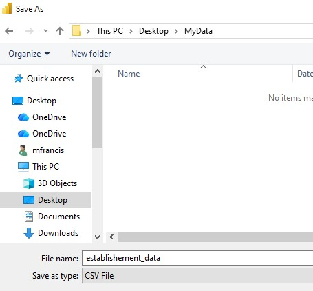
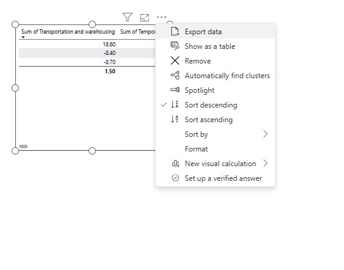

---

### Initial Visual Builds
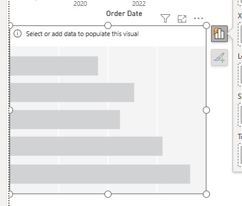
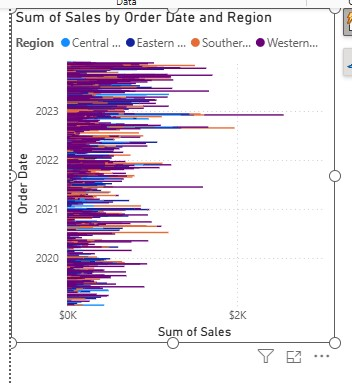
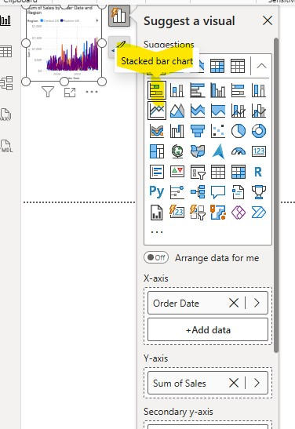


---

### Sorting & Modeling Fix
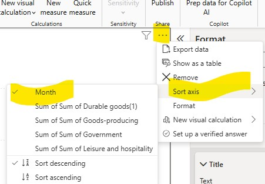
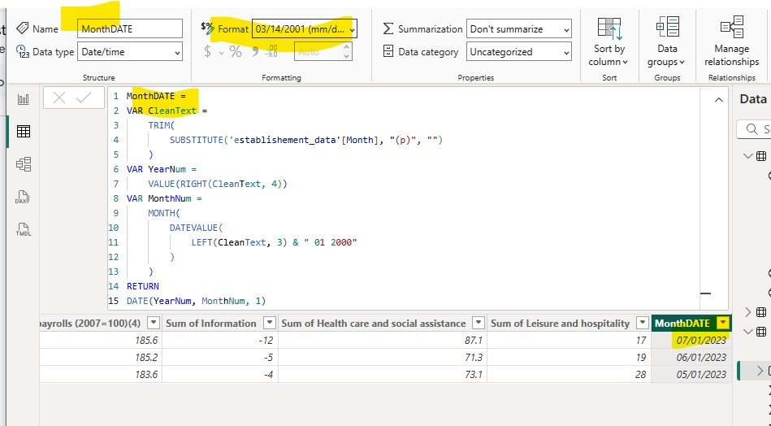
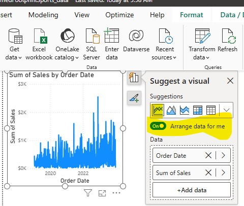
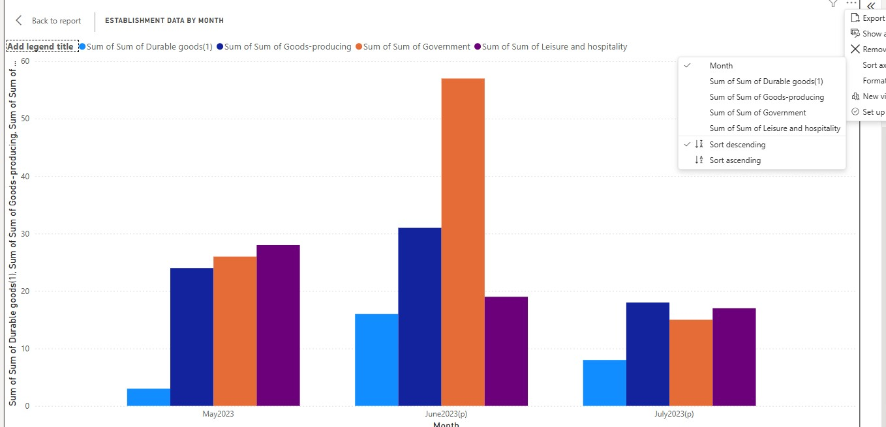

---

### Visual Refinement
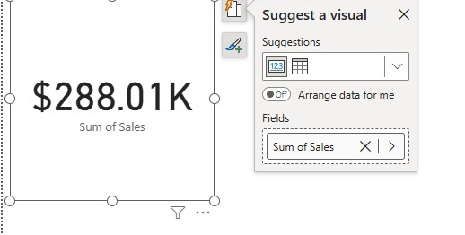
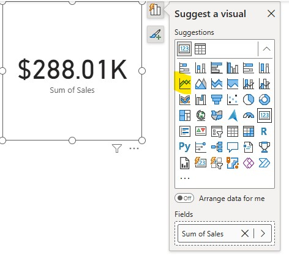
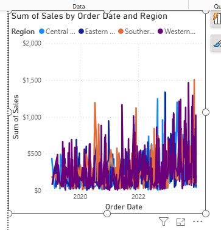
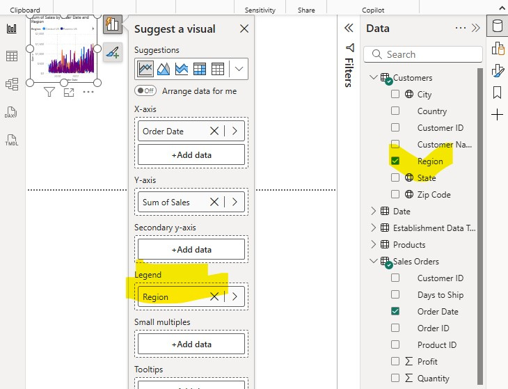
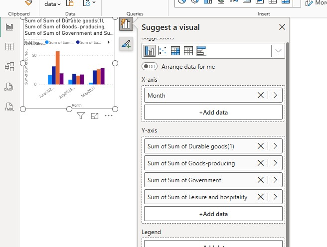
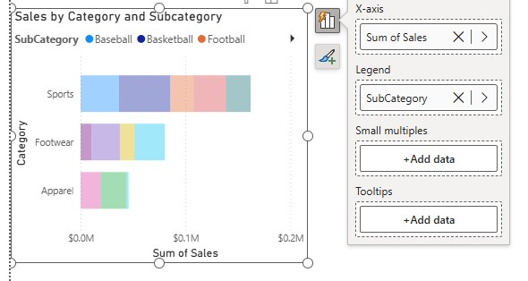

---

### Waterfall Chart Development
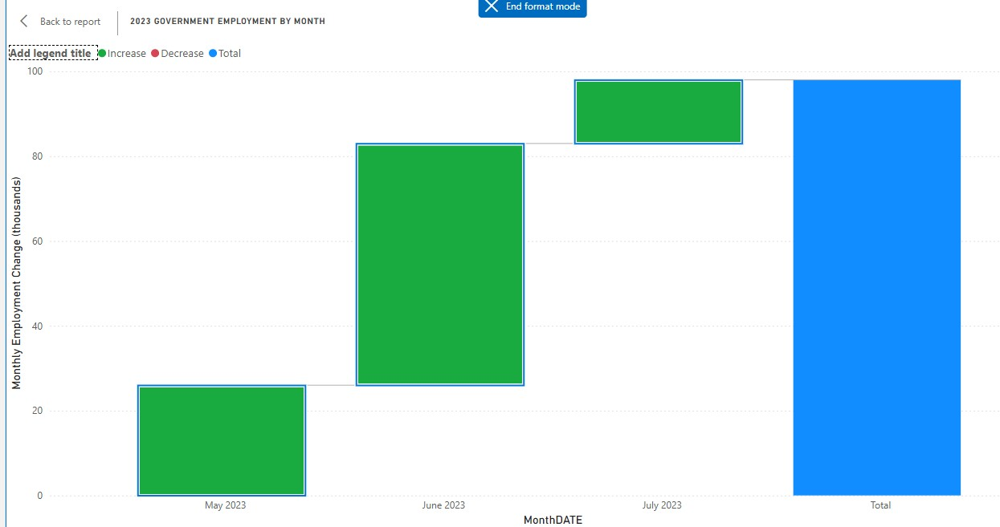
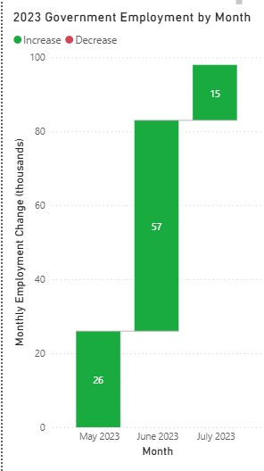
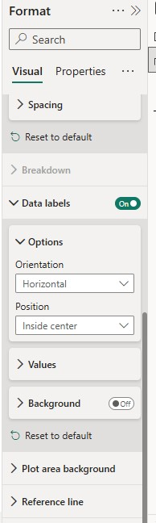

---

### Final Visuals & Polish
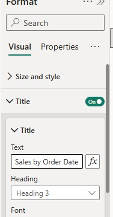
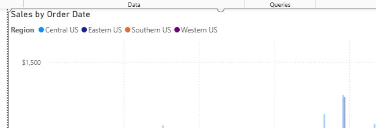
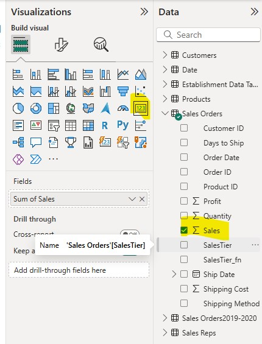
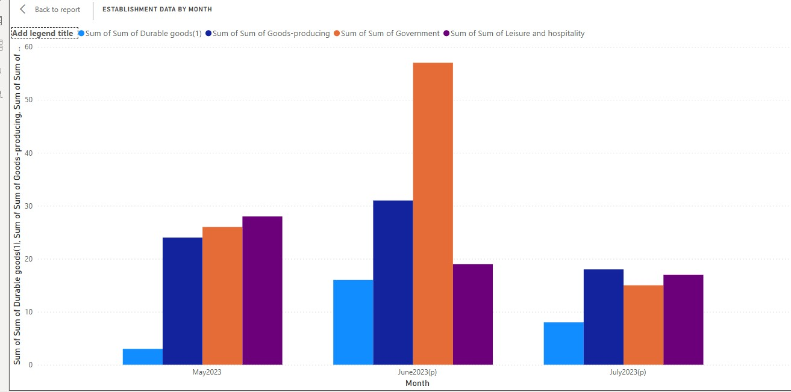

---

## 📌 Final Dashboard
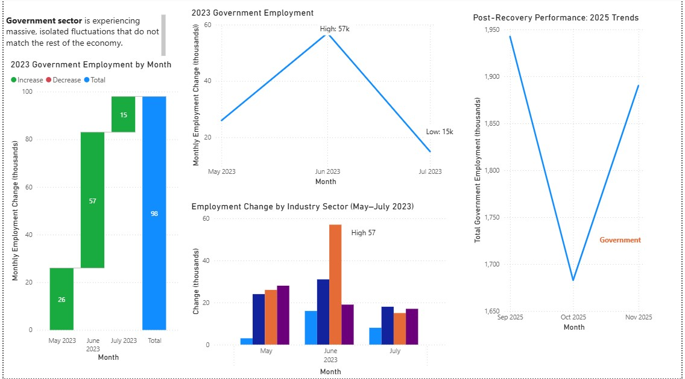

---

## 💡 Key Insights
- Government employment showed **isolated volatility**, diverging from all other sectors  
- **June 2023** accounted for over **50% of total quarterly growth**  
- Other sectors remained comparatively stable, confirming the outlier behavior  

---

## 💼 Business Value
This dashboard enables stakeholders to:
- Detect abnormal employment trends quickly  
- Understand cumulative vs. point-in-time changes  
- Rely on clean, chronologically accurate reporting  

---

## 🧠 Why This Project Is Portfolio-Ready
✔ Demonstrates real-world **DAX problem-solving**  
✔ Shows full **analysis lifecycle**, not just visuals  
✔ Applies **executive-level storytelling**  
✔ Uses best practices in Power BI modeling and design  

---

*Created by Marlainna Francis — Power BI | Data Analytics | Business Intelligence*
