# 📊 Sales Analytics Dashboard (Power BI)

> **An end-to-end Power BI project demonstrating data modeling, DAX problem-solving, and executive-ready data storytelling.**

---

## 🔍 Project Overview
This project analyzes sales performance using Microsoft Power BI, with a focus on exploring sales trends across time, products, categories, subcategories, and regions.

The project documents the development process from data import and exploration through visualization, data modeling, troubleshooting, and final dashboard refinement.

Rather than showing only the finished report, the project captures the iterative process used to build and improve the dashboard.
---

## 🎯 Business Question
The dashboard was developed to explore:

How sales change over time
How sales vary across regions
Which product categories and subcategories are represented in the sales data
How different visualizations can be used to analyze sales performance
How sales information can be presented in an interactive business dashboar
---

## 🛠 Tools & Technologies
- Power BI Desktop  
- DAX (Calculated Columns)  
- Power Query (Data Cleaning)  
- Time-Series Analysis  
- Business Intelligence & Data Storytelling  

---

## 📁 Data Preparation & Modeling

### Problem: Month Sorting Error
Month values were stored as text (e.g., `June 2023 (p)`), which caused **alphabetical sorting** in visuals.

❌ June → July → May  
✅ May → June → July  

### Solution: DAX Helper Column
A calculated date column was created to enforce chronological sorting.

```DAX
MonthDATE = 
VAR CleanText = 
    TRIM(
        SUBSTITUTE('establishement_data'[Month], "(p)", "")
    )
VAR YearNum = 
    VALUE(RIGHT(CleanText, 4))
VAR MonthNum = 
    MONTH(
        DATEVALUE(
            LEFT(CleanText, 3) & " 01 2000"
        )
    )
RETURN
DATE(YearNum, MonthNum, 1)
```

The helper column was used with **Sort by Column** and then hidden for a clean data model.

---

## 🧱 Visual Development Process

### Data Import & Exploration
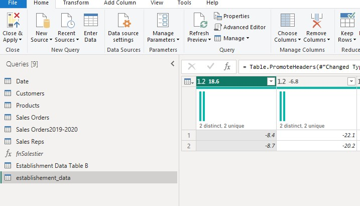
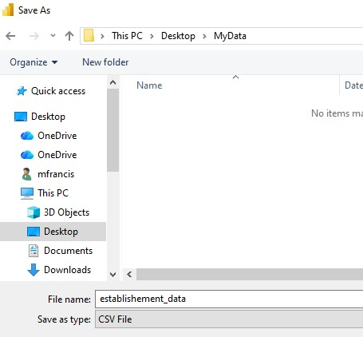
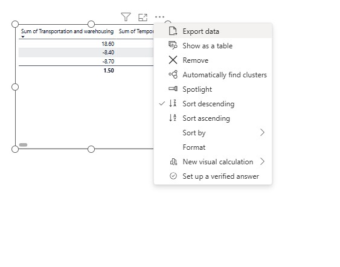

---

### Initial Visual Builds
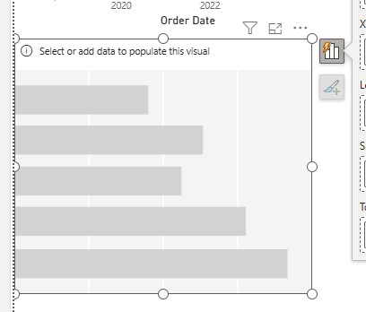
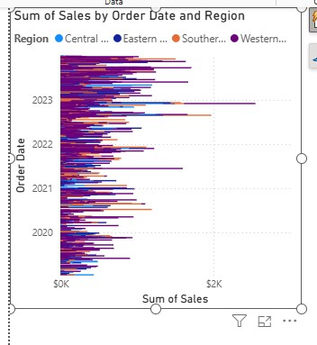
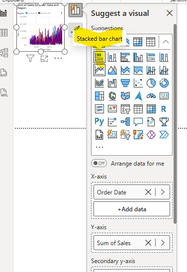
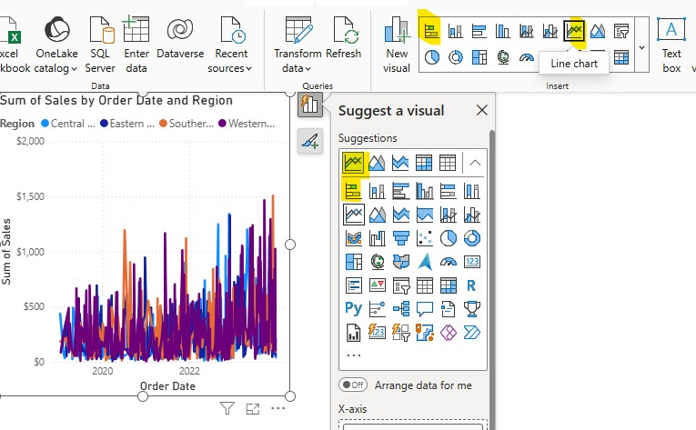

---

### Sorting & Modeling Fix
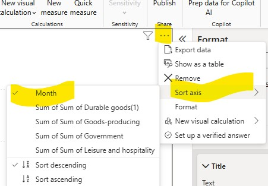
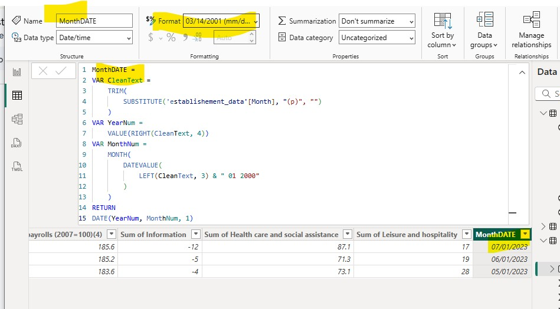
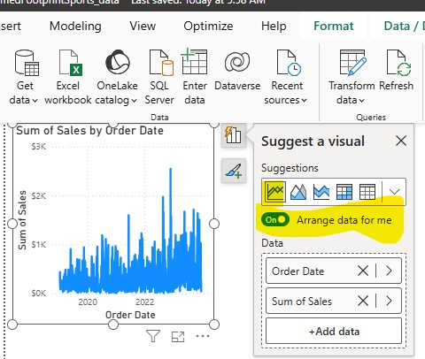
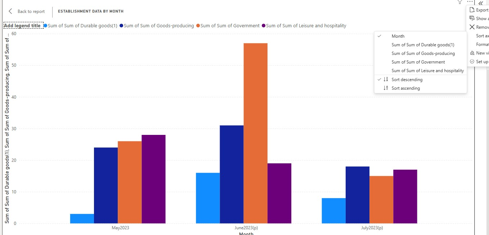

---

### Visual Refinement
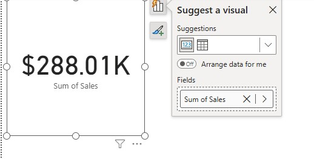
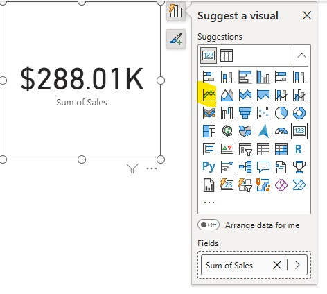
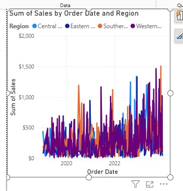
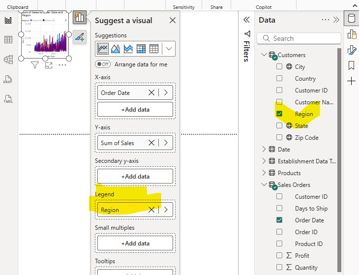
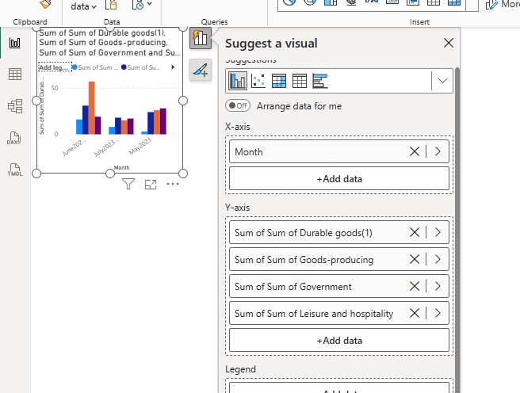
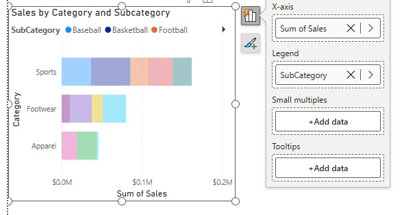

---
 

### Final Visuals & Polish
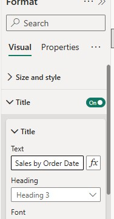
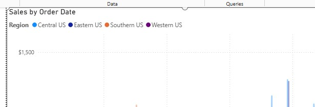
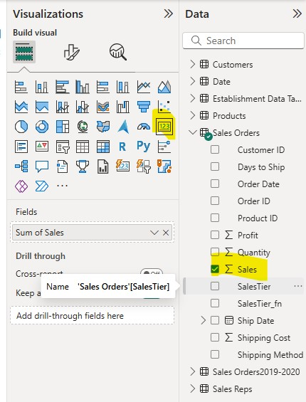
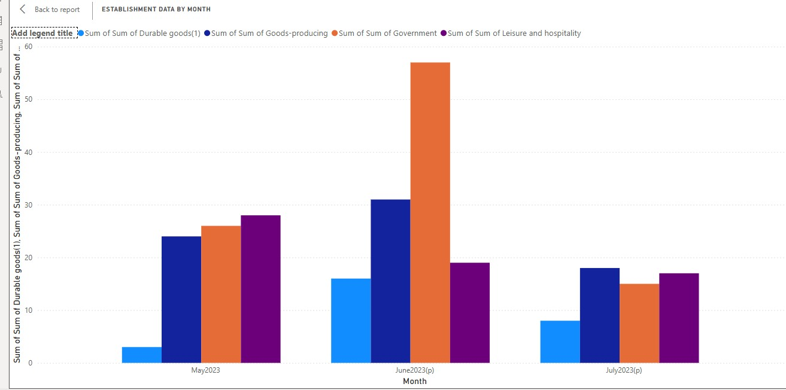

---
 

## 💡 Key Insights
- Government employment showed **isolated volatility**, diverging from all other sectors  
- **June 2023** accounted for over **50% of total quarterly growth**  
- Other sectors remained comparatively stable, confirming the outlier behavior  

---

## 💼 Business Value
This dashboard enables stakeholders to:
- Detect abnormal employment trends quickly  
- Understand cumulative vs. point-in-time changes  
- Rely on clean, chronologically accurate reporting  

---

## 🧠 Why This Project Is Portfolio-Ready
✔ Demonstrates real-world **DAX problem-solving**  
✔ Shows full **analysis lifecycle**, not just visuals  
✔ Applies **executive-level storytelling**  
✔ Uses best practices in Power BI modeling and design  

---

*Created by Marlainna Francis — Power BI | Data Analytics | Business Intelligence*
