# 📊 Power Query Data Cleaning Project

---

## 🗂️ Source Data Import

### **Get Data From Excel**

---

## 🔎 Preview & Initial Checks

### **Data Preview Before Any Changes**
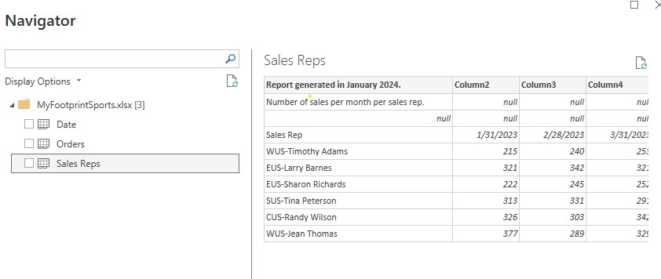

### **Sales Rep Column Has a Dash Issue**
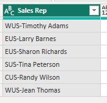

### **Power Query Loads & Shows Applied Steps**

---

## ✂️ Step 1 — Remove Top Rows

### **Remove Top 2 Rows**
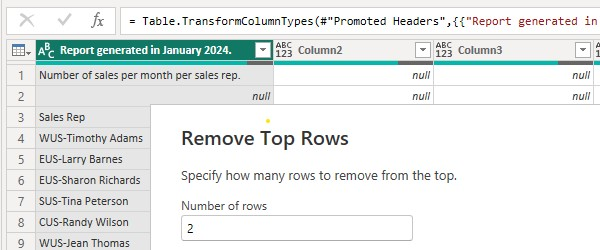

### **Applied Step Confirmation**
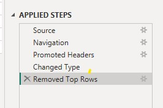

---

## 🏷️ Step 2 — Use First Row as Headers

### **Before Applying Headers**
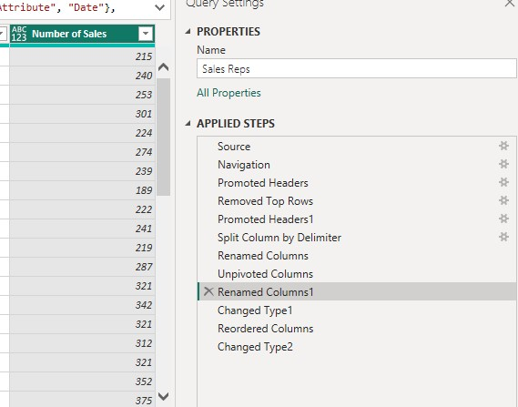

### **Use First Row as Headers**

### **After Applying Headers**
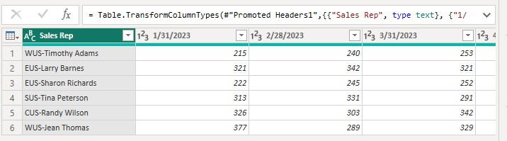

---

## 🔤 Step 3 — Split Column by Delimiter

### **Open Split Column Tool**
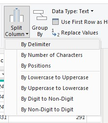

### **Auto-Selected Delimiter Box**
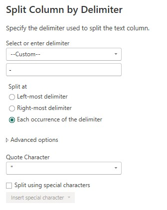

### **Rows After Split Completed**

---

## 🔄 Step 4 — Change Data Types

### **Before Changing Data Type**

### **After Correction**

### **After Date Column Reformatted**
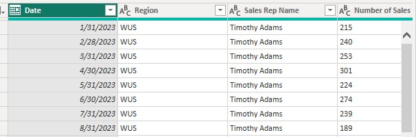

---

## 📝 Step 5 — Rename Columns

### **Applied Steps After Rename**

### **Data After Rename**

---

## 🔁 Step 6 — Unpivot Columns

### **Unpivot Columns**

### **Applied Steps After Unpivot**

### **Data After Unpivot**
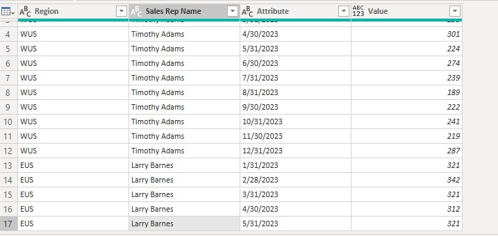

---

## ✔️ Final Review

### **Final Clean Dataset**
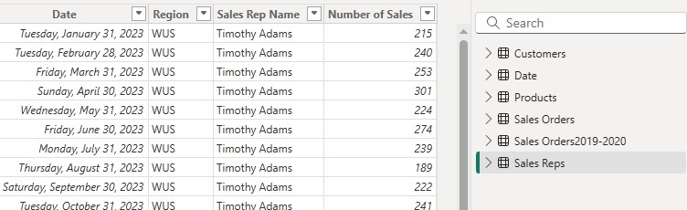

---

## 💾 Close & Apply

### **Save & Load Data to Power BI**

