### 1️⃣ Connect Raw Data Sources into Power BI
* **Connecting Source Data:**  
  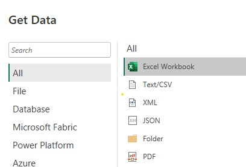
* **Navigator Preview:**  
  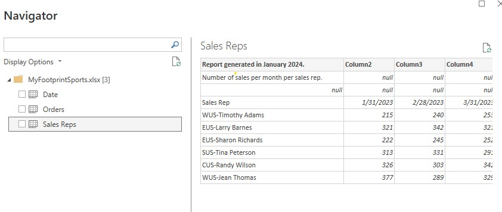
* **Initial Query Load:**  
  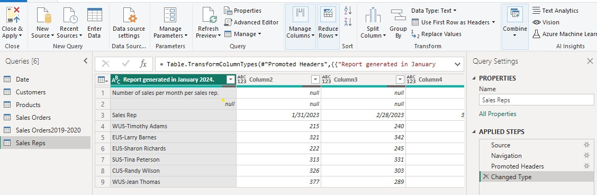

---

### 2️⃣ Standardize Column Headers
* **Removing Metadata Rows:**  
  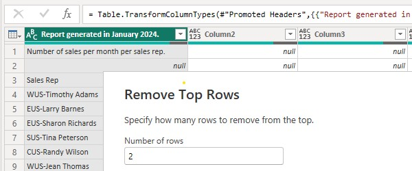
* **Promoting First Row to Headers:**  
  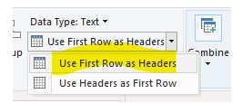
* **Splitting Delimited Columns:**  
  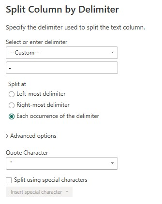
* **Renaming Standard Headers:**  
  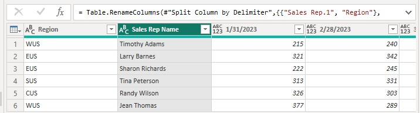

---

### 3️⃣ Reformat Column Data Types
* **Unpivoting Monthly Fields:**  
  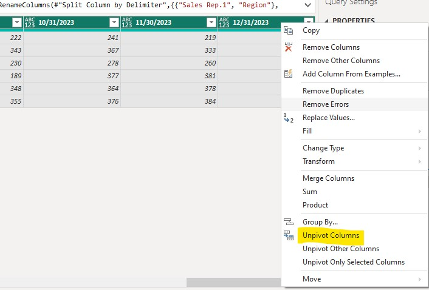
* **Fixing Mixed Data Types:**  
  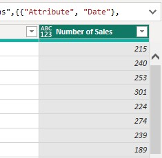
* **Updating Field Formats:**  
  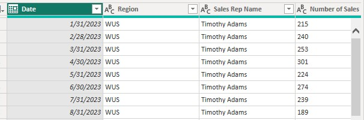
* **Final Formatted Dataset:**  
  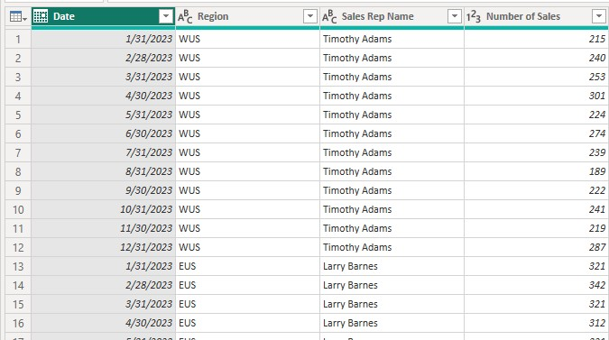

---

### 4️⃣ Prepare Datasets for Downstream Transformations
* **Auditing Transformation Timeline:**  
  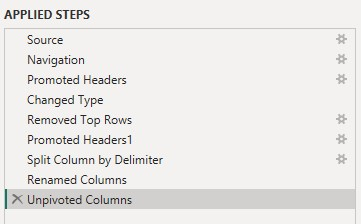
* **Final Model Review:**  
  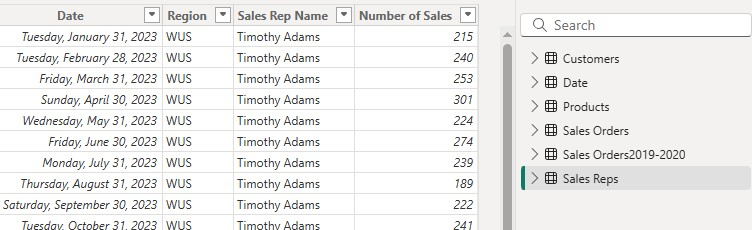
* **Loading to Data Model:**  
  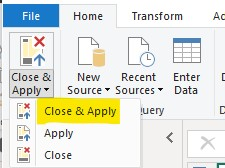
