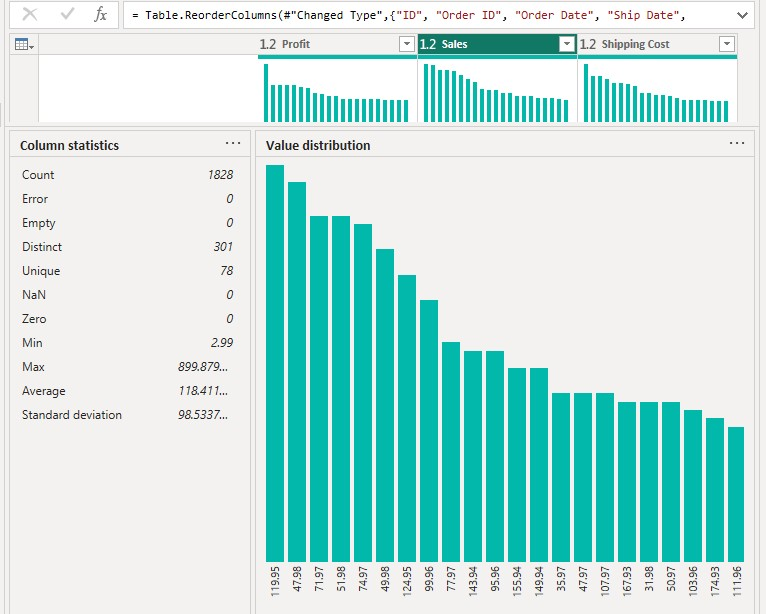

# 📊 Power BI Data Profiling Showcase: Sales Transaction Data

This document outlines the initial data quality assessment (profiling) and interpretation of key statistical properties to determine the data's fitness for analysis and reporting.

## 1. Data Quality Assessment and Interpretation

The data was profiled column-by-column to assess completeness, accuracy, and distribution before any major transformations or dashboard development began.

---

### A. Sales (Numerical Measure)

The Sales column is characterized by high variability, requiring the data to be segmented for meaningful analysis.

| Statistic | Value |
| :--- | :--- |
| **Count** | 1,828 |
| **Max Value** | $899.88 |
| **Average Sale** | $118.41 |
| **Standard Deviation (SD)** | $98.53 |
| **Data Quality** | 0 Errors, 0 Empty |

#### **Interpretation:**
The large **Standard Deviation ($\$$98.53)** is nearly equal to the Average ($\$$118.41). This confirms an **extreme spread** and a highly skewed distribution. The Max value of $\$$899.88 acts as a **significant outlier**. This column is high cardinality (301 distinct values) and should be used as an **aggregate measure (SUM, AVG)**, not a grouping dimension.

#### **Image:**  

---

### B. Product ID (Categorical Dimension)

This column is clean and serves as an excellent dimension for grouping sales.

| Statistic | Value |
| :--- | :--- |
| **Count** | 1,828 |
| **Distinct** | 256 |
| **Most Frequent ID** | SP-S-6604 (3% of transactions) |
| **Data Quality** | 0 Errors, 0 Empty |

#### **Interpretation:**
The column has **perfect data quality** and a medium-low cardinality (256 distinct IDs). This makes it an **excellent dimension** for grouping sales data. The ID **SP-S-6604** is identified as the most frequently sold product and should be a focus for inventory and sales performance analysis.

#### **Image:**  

---

### C. Shipping Method (Categorical Dimension)

This column is clean and ideal for simple filtering due to its low number of categories.

| Statistic | Value |
| :--- | :--- |
| **Count** | 1,828 |
| **Distinct** | 4 |
| **Most Frequent** | Standard (61%) |
| **Data Quality** | 0 Errors, 0 Empty |

#### **Interpretation:**
This is a **low-cardinality dimension** (4 distinct categories) with **perfect data quality**. The distribution is heavily skewed toward **Standard** shipping, which accounts for 61% of orders.

#### **Image:**  

---

### D. Order Date (Time Series Dimension)

This column defines the time frame and is essential for trend analysis.

| Statistic | Value |
| :--- | :--- |
| **Count** | 1,828 |
| **Min Date** | 1/3/2021 |
| **Max Date** | 12/31/2023 |
| **Distinct Dates** | 552 |
| **Data Quality** | 0 Errors, 0 Empty |

#### **Interpretation:**
The column has **perfect data quality** and defines the dataset's history spanning nearly three years. It has a high distinct count (552) and must be used for **time-series analysis** by grouping into hierarchies (Year/Month/Quarter), not by individual date values.

#### **Image:**  

---

## 2. Summary of Key Findings

This section summarizes the column relationships and their impact on dashboard design.

### Interpretation:
Time series columns (like Order Date) are **excluded from the low-cardinality dimension group** because they are handled differently in analysis. The Sales column is considered **high cardinality** only in comparison to the other columns in the model.

* **High Cardinality:** With 301 distinct values out of 1,828 records, Sales has a much higher cardinality than your other columns, such as Shipping Method (4 distinct values) and Product ID (256 distinct values).
* **High Variability:** The Standard Deviation ($\$98.53) is nearly equal to the Average ($\$118.41). This indicates extreme spread in the data, with the Max value of $\$899.88$ acting as a **significant outlier**.
* **Data Quality:** The column is perfectly clean (0 Errors, 0 Empty) and ready for calculations.

### Conclusion for Dashboard Use
Because the Sales column is a high-cardinality measure with high variability, it should be used for **calculations (SUM, AVG, COUNT)** and should always be viewed **segmented** by your low-cardinality dimension columns, such as shipping method or product ID.