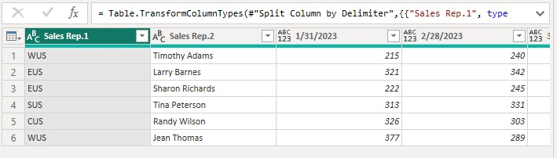

# 📊 Data Profiling & Statistics (Step 2)

## 📌 Overview
After connecting the initial source data, the next critical phase in the ETL pipeline is **Data Profiling, Quality Assessment, and Structure Inspection**. This step evaluates missing values, verifies structural alignment across columns, and cleans unformatted raw headers before applying advanced transformations.

---

## 🛠️ Key Profiling & Data Quality Steps

### 1️⃣ Initial Data Source & Navigator Assessment
- Evaluated the incoming Excel worksheet structures (`MyFootprintSports.xlsx`) prior to loading.
- Identified unformatted metadata rows (`Report generated in January 2024.`) and unassigned column names (`Column2`, `Column3`, `Column4`).

*Figure 2.1: Initial preview of raw data structure in the Power Query Navigator.*

---

### 2️⃣ Query Structure & Metadata Cleanup
- Profiled the initial table state in Power Query Editor to identify non-data rows and null fields.
- Removed top administrative header rows to align the real table headers.

*Figure 2.2: Identifying null values and misplaced header rows in the query editor.*

*Figure 2.3: Removing top non-data rows to clean table boundaries.*

---

### 3️⃣ Column Parsing & Delimiter Profiling
- Assessed composite text values inside the `Sales Rep` column (`Region-Name` format).
- Used delimiter profiling to split attributes cleanly into dedicated `Region` and `Sales Rep Name` columns.

*Figure 2.4: Configuring text delimiter splitting based on hyphenated rep identifiers.*

*Figure 2.5: Resulting isolated Region and Sales Rep columns.*

---

### 4️⃣ Data Unpivoting & Final Validation
- Transformed wide monthly date columns into a normalized columnar layout using the **Unpivot Columns** feature.
- Applied correct data types across all fields (`Date`, `Text`, `Whole Number`) and conducted a final visual audit of row values.

*Figure 2.6: Unpivoting monthly sales columns into flat relational attribute rows.*

*Figure 2.7: Final inspection of cleaned, typed, and structured fields.*

---

## 📈 Outcomes & Summary Findings

- **Data Quality Verified:** Successfully removed redundant metadata rows and addressed null values.
- **Normalized Schema:** Converted wide cross-tabulated date columns into a structured tall dataset.
- **Pipeline Ready:** Ensured clean schema formatting before moving into custom function development and modeling.

---

## 🔗 Related Links & Steps

* ⬅️ **Previous Step:** [1️⃣ Connect Data & Reformat Columns](./ConnectData_Reformat_Headers_columns-1.md)
* ➡️ **Next Step:** [3️⃣ Custom Functions (Advanced Query Editor)](./query_advanced_editor_customFun-3.md)
* 🏠 **Main Repository:** [Power BI Analysis Repo](https://github.com/yourexodus/mfrancis_PowerBI_Analysis)
* 🌐 **Portfolio Site:** [Marlainna The Analyst Portfolio](https://yourexodus.github.io/MarlainnaTheAnalyst/)
