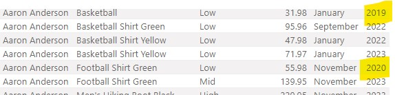
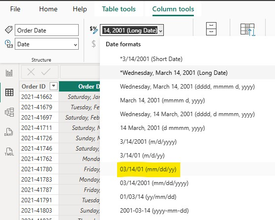

## Purpose of This Work

The purpose of this data shaping process was to prepare data for accurate reporting by:

- Reviewing and correcting table relationships
- Appending multiple sales tables
- Cleaning and validating data
- Applying correct data categories and formatting
- Creating calculated columns
- Building report visuals from a clean data model

---

## Reviewing and Managing Table Relationships

The first step was to review existing relationships in the data model.

Actions performed:
- Opened **Model View**
- Inspected relationships between tables
- Verified **cardinality** (many-to-one where expected)
- Identified inactive relationships

---

## Activating Relationships

Inactive relationships were reviewed and activated to ensure proper filtering across tables.

Steps:
- Selected inactive relationship
- Verified join columns
- Set relationship to **Active**
- Saved changes

---

## Validating Date Table Relationships

The Date table relationship was reviewed and confirmed.

Steps:
- Verified correct date fields
- Confirmed relationship direction
- Saved relationship configuration

---

## Appending Sales Tables

Multiple sales tables were combined into a single table using Power Query.

Steps:
- Selected **Append Queries**
- Appended sales tables
- Verified column alignment
- Applied changes

---

## Cleaning and Validating Data

Data cleanup was performed to remove invalid records.

Actions:
- Identified missing Customer IDs
- Removed error rows
- Applied filters to clean data

---

## Formatting Data Fields

Formatting updates were applied to ensure correct aggregation and display.

Actions:
- Applied currency formatting
- Disabled summarization where required
- Standardized date formats

---

## Setting Geographic Data Types

### Task: Set the geographic data type for geographic fields

To ensure accurate geographic analysis and mapping, geographic fields were assigned the appropriate data categories.

Steps performed:

1. In the **Data pane**, expanded the **Customers** table.
2. Selected the **City** column.
3. Opened the **Column tools** tab.
4. From the **Data category** drop-down list, selected **City**.

5. Selected the **Country** field and applied the **Country** data category.
6. Selected the **State** field and applied the **State or Province** data category.
7. Selected the **Zip Code** field and applied the **Postal code** data category.
8. Selected the **Report View** icon.
9. Clicked **Save**.

This ensures Power BI correctly interprets geographic fields for filtering and mapping visuals.

---

## Creating a Calculated Column: Days to Ship

A calculated column was created to measure the number of days between order date and ship date.

Steps:
- Inserted a new column
- Calculated date difference
- Converted values to whole numbers
- Reviewed results for accuracy

---

## Report View and Visual Creation

After completing data preparation, visuals were created in Report View.

Steps:
- Returned to Report View
- Selected table visual
- Added fields from the data model
- Verified results

---

## Final Report Review

The final report was reviewed to ensure all changes were reflected correctly.

- Verified visuals updated after transformations
- Confirmed calculated columns displayed correct values
- Ensured report was ready for analysis

---

## Skills Demonstrated

- Power BI Data Modeling
- Relationship Management
- Power Query Transformations
- Data Cleaning and Validation
- Geographic Data Categorization
- Calculated Columns
- Report Development

---

## Tools Used

- Power BI Desktop
- Power Query Editor

---

## Notes

This documentation reflects only the steps performed and captured in the original project notes and screenshots.  
No additional assumptions or undocumented features were added.