# Power BI Data Shaping & Modeling

This document walks through the **data shaping and modeling work** done in Power BI Desktop for the Sales dataset.  
All steps and screenshots reflect the documented workflow from the original project notes. :contentReference[oaicite:2]{index=2}

> **Note:** Images are stored in the repository at:
>
> `images_dataShaping/`

---

## Purpose

This project focused on preparing the dataset for accurate reporting and analysis by:

- Reviewing and activating relationships between tables  
- Appending multiple sales tables  
- Cleaning and transforming data  
- Setting correct data categories, including geographic fields  
- Creating calculated columns  
- Building visuals and confirming data integrity in the report view

---

## 🧩 Reviewing and Activating Relationships

### Review Relationships  
Opened the Model view to inspect table relationships and cardinality.

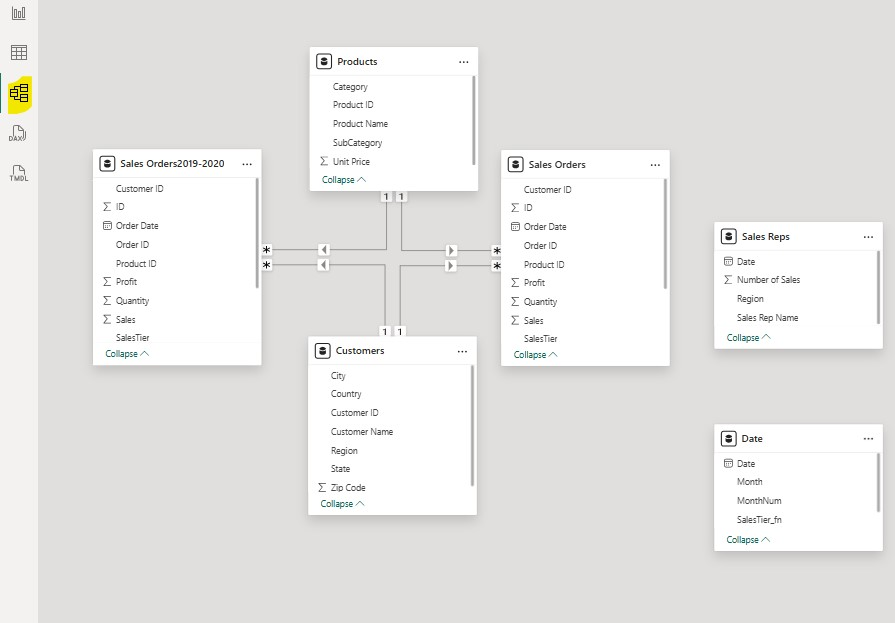
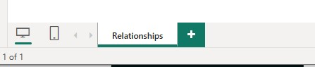
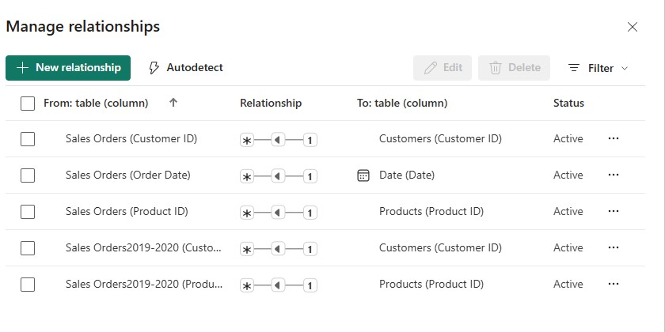

### Manage and Activate Relationships  
Activated any inactive relationships to ensure proper filtering across tables.

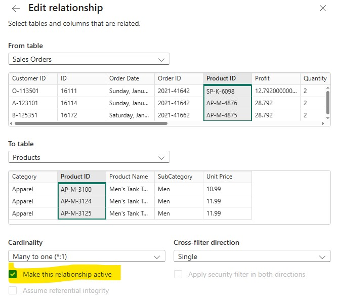

---
## 📅 Date Table Relationship

Connected the **Date** table to the **Sales Orders** table by dragging the Date field to Order Date.

Steps:
1. Select the Date table 
2. Click the Date field
3. Drag Date field to the Order Date in the Sales Orders table 
4. New Relationship box will pop up. 
5. Click save 

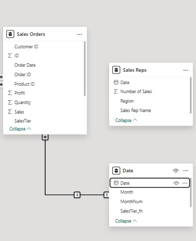
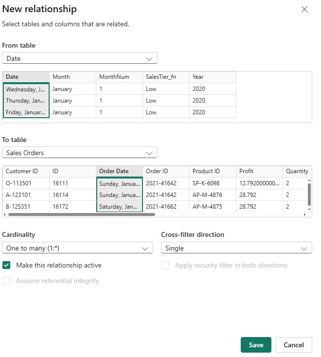

---

## 📌 Summarization Settings

Disabled summarization for the `MonthNum` field in the Date table.

> This avoids Power BI automatically summing month numbers in visuals. :contentReference[oaicite:3]{index=3}

Steps:
1. Click Table View 
2. Expand Date Table
3. Click MonthNum
4. On the Column tools tab, from Summarization drop down list, select Don’t Summarize

---

## ➕ Appending Sales Tables

Appended the historical Sales Orders (2019–20) table into the main Sales Orders table.

Steps:

1. Select Home→Transform data→Transform data.
2. In the Queries pane, select the Sales Orders table.
3. Select Home→Append Queries→Append Queries.

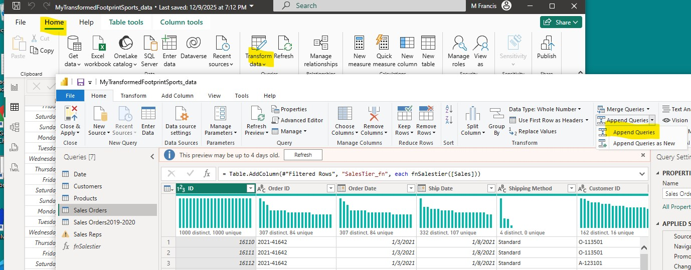

Steps:

1. Home→Combine→Append Queries→Append Queries.
2. In the Append dialog box, verify that Two tables is selected.
3. From the Table to append drop-down menu, select Sales Orders2019-20.

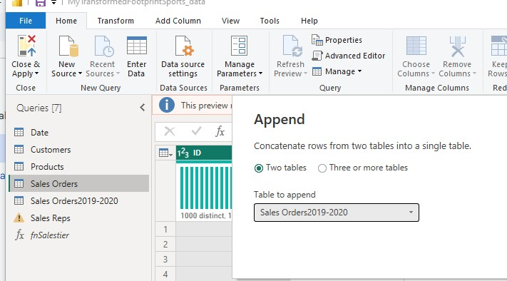

Click Ok, close and Apply

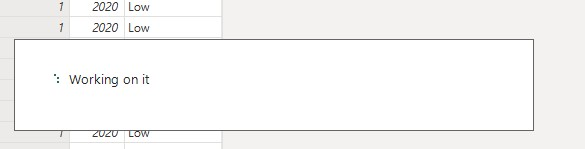

---

## 📊 Create Table Visual (Basic Confirmation)

Returned to Report View and added a Table visual to confirm that data loaded correctly.

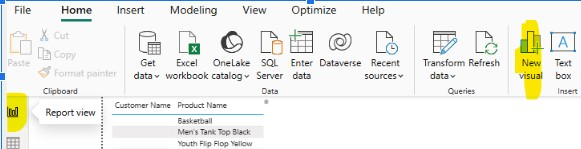

Home→ Table Icon.
Confirm the Table visualization is selected.  Notice the New Visual Option will only appear after you click the Report View

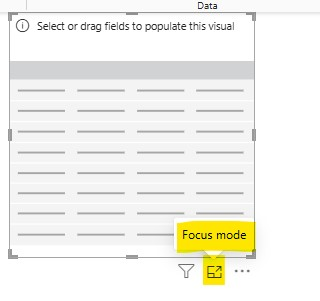

Steps:
1. Expand the Data pane on the right
2. Drag or check desired fields 
3. Click Back to Report

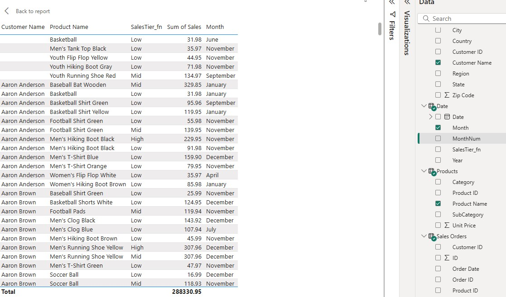

Confirm data on canvas:
Customers: Customer Name
Products:Product Name
Date: Year, Month

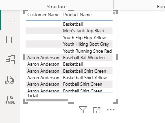

---

## 🧹 Cleaning and Removing Errors

Identified and removed records with erroneous Customer IDs from the Sales Orders table.

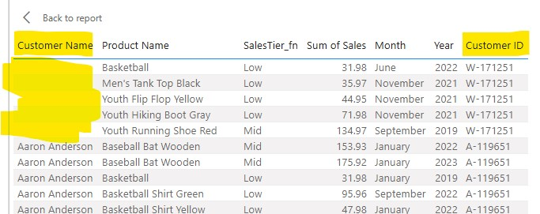

Remove Errors using Filter

Steps:
1. Select Home→Transform data→Transform data.
2. In the Queries pane, select the Sales Orders table.
3. In the center pane, in the Customer ID header, expand the drop-down list.
4. You might have to scroll to the right to see the Customer ID column.
5. Scroll down and uncheck the W-171251 check box.
6. Cick ok
7. Click close and apply

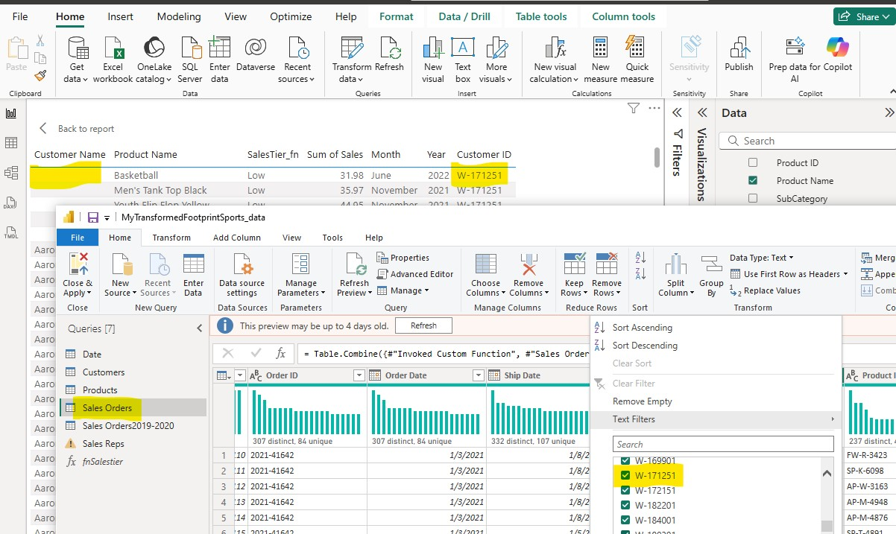

---

## 🔢 Data Formatting

Applied currency and number formatting so fields like Sales, Profit, and Shipping Cost display correctly.

Sales column: Reformat as currency
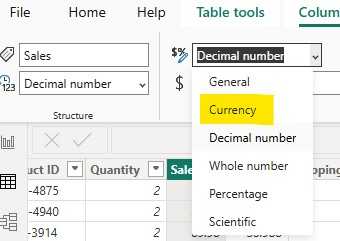

Order Date column:  Reformat as Date mm/dd/yyyy
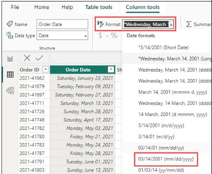

---
## 📐 Calculated Column: Days to Ship

Created a **Days to Ship** column to measure shipment duration:

Steps:
1. On the Add Column tab 
2. select Custom Column
3. In the Custom Column dialog box 

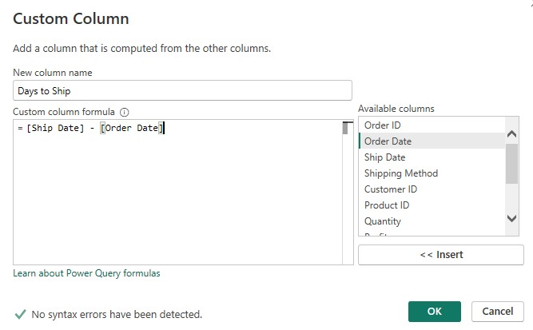

Change the data type for Days to Ship to a whole number.
Steps:
1. select the Days to Ship column.
This is the last column in the table.
2. Select Transform→Data Type: Any→Whole Number.
3. Click save

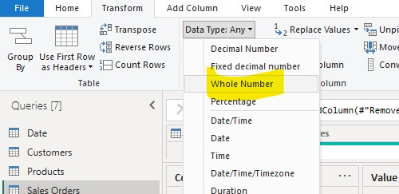

Uncheck ID field  
Check the Days to ship field 
Confirm Days to Ship field is present on canvas.

---

## 📍 Setting Geographic Data Types

Assigned the correct data category for geographic fields in the Customers table:

1. Expanded **Customers** in the Data pane. :contentReference[oaicite:4]{index=4}  
2. Set **City** → *City*  
3. Set **Country** → *Country*  
4. Set **State** → *State or Province*  
5. Set **Zip Code** → *Postal code*  
6. Returned to Report View and saved.

> Assigning correct geographic categories enables accurate mapping and filtering.

---

## 📈 Review in 

Confirmed that visuals are working with cleaned and transformed data:

- Checked table visuals  
- Added fields from Customers, Products, and Date tables

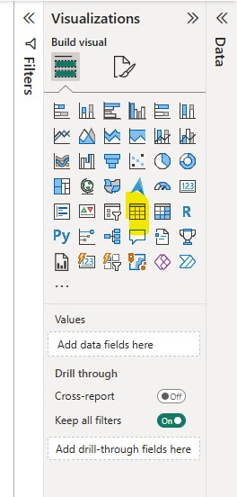

---

## 📈 Review in Code Advanced Editor

Steps
1. Home -> transform Data
2. click Sales Orders Table
3. click Advanced Editor

.jpg)
---
## 📊 Final Report Review

Verified visuals after all transformations were applied:

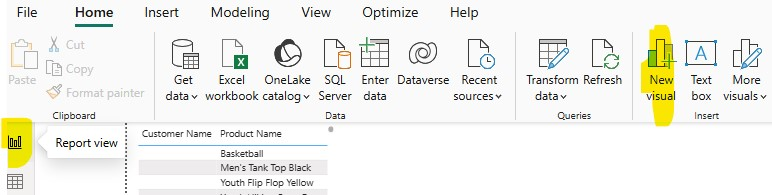
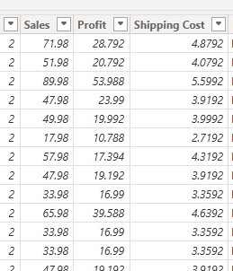

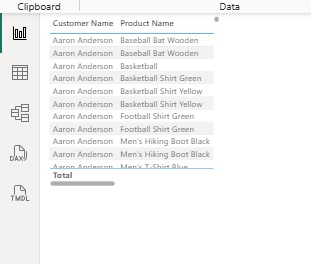

---

## 🛠 Skills Demonstrated

- Power BI Data Modeling  
- Query Transformation & Cleaning  
- Geographic Data Categorization  
- Calculated Columns  
- Visual Validation  
- Report View Verification

---

## 🧰 Tools Used

- Power BI Desktop  
- Power Query Editor  
- Built-in Power BI modeling features