# ⚡ Data Shaping, Transformation & Model Building (Step 4)

## 📌 Core Objectives Covered

* **Appended Multiple Datasets:** Combined historical sales transaction tables into a single unified fact table to establish a consolidated data foundation.

* **Aligned Schemas Across Tables:** Standardized column names, order sequence, and compatible data types across tables prior to merging to prevent missing or misplaced attributes.

* **Applied Transformations:** Executed essential Power Query transformations, including date interval math (`DaysToShip`), numeric data type conversions, and error row filtering.

* **Prepared Data for Modeling and Reporting:** Established active 1-to-many relationship cardinalities, set geographic data categories (e.g., City), applied currency formatting, and built table visuals to validate metric accuracy.

---

## 🛠️ Step-by-Step Execution & Breakdown

### 1️⃣ Custom Date Calculations & Field Cleanup

**Step 1.1:** Open the `Sales Orders` table in Power Query and review the target fields needed for calculated columns.

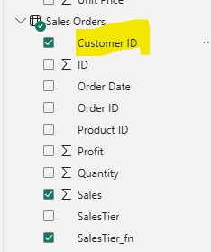

**Step 1.2:** Inspect the underlying order and ship date fields to prepare for date math calculations.

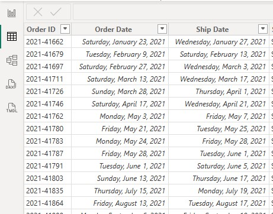

**Step 1.3:** Click **Add Column** on the ribbon tab to initialize custom step creation.

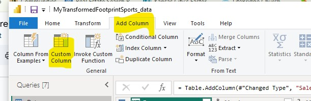

**Step 1.4:** Calculate the duration between order and ship dates, confirming the calculated `DaysToShip` values.

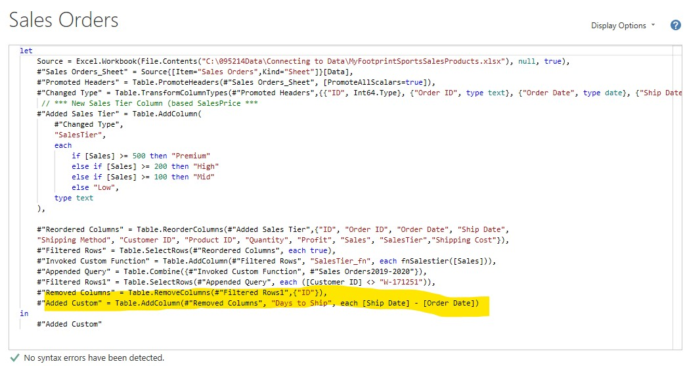

**Step 1.5:** Change the data type of `DaysToShip` to **Whole Number** to enable numerical aggregation.

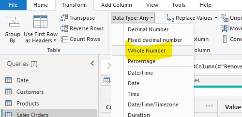

**Step 1.6:** Inspect the updated M code script in the Advanced Editor to confirm step syntax.

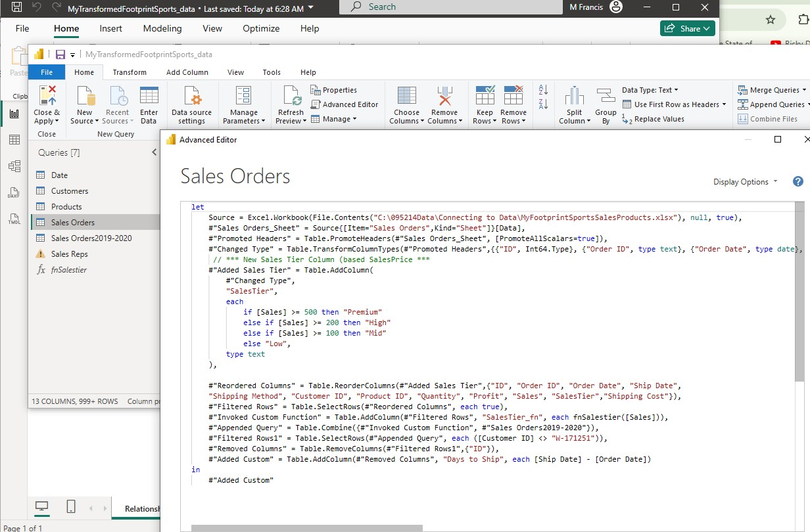

**Step 1.7:** Remove non-matching or erroneous records using column filters to ensure clean data joins.

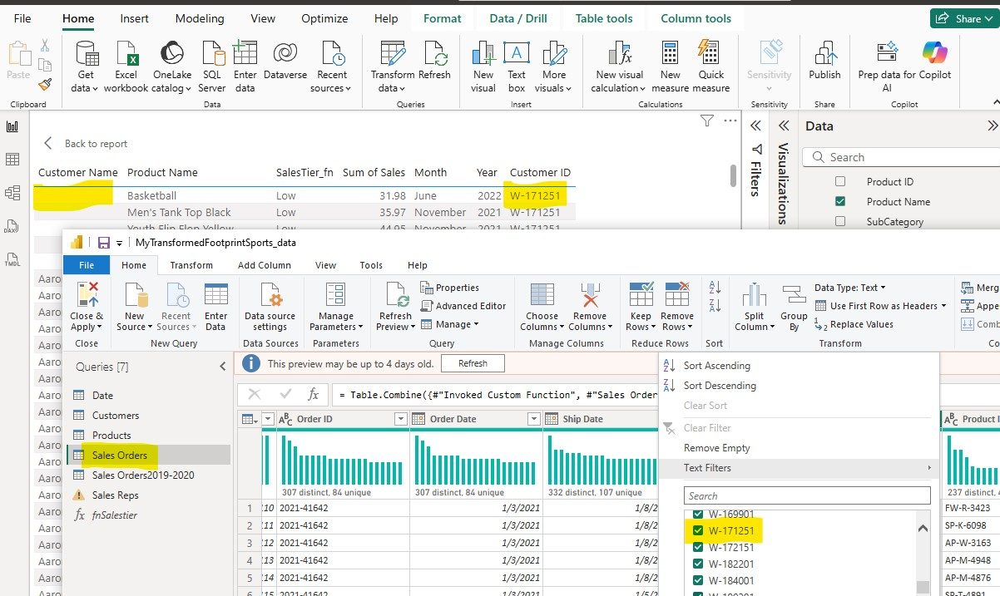

---

### 2️⃣ Aligning Schemas & Appending Datasets

**Step 2.1:** Align column structures, data types, and attribute names across separate tables to prepare for clean union operations.

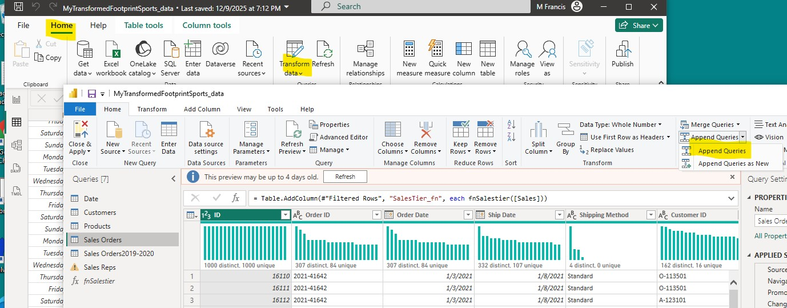

**Step 2.2:** Click **Append Queries** from the Home ribbon tab to stack and append multiple datasets into one consolidated table.

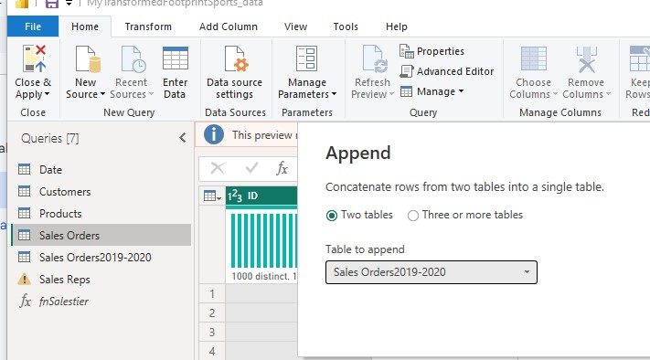

**Step 2.3:** Apply transformations from the Home ribbon to close Power Query and load the merged structure into the data engine.

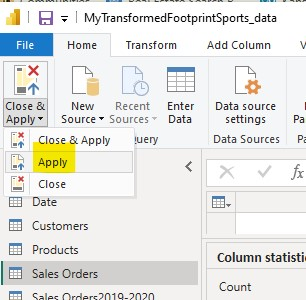

**Step 2.4:** Click **Close & Apply** to update the Power BI Desktop data model.

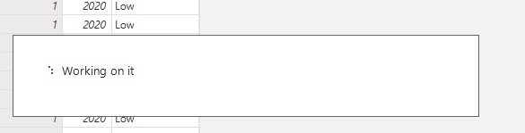

**Step 2.5:** Save the updated PBIX file (`MyTransformedFootprintSports_data.pbix`) to lock in query transformations.

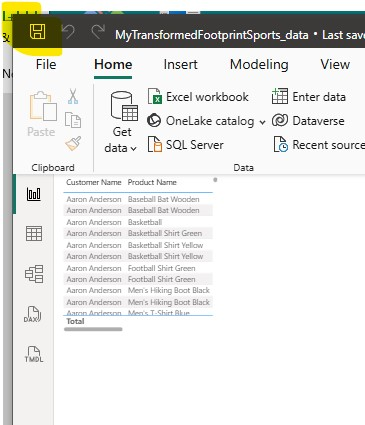

---

### 3️⃣ Managing Data Model Relationships

**Step 3.1:** Switch to the Model View tab to evaluate current table relationships and schema layout.

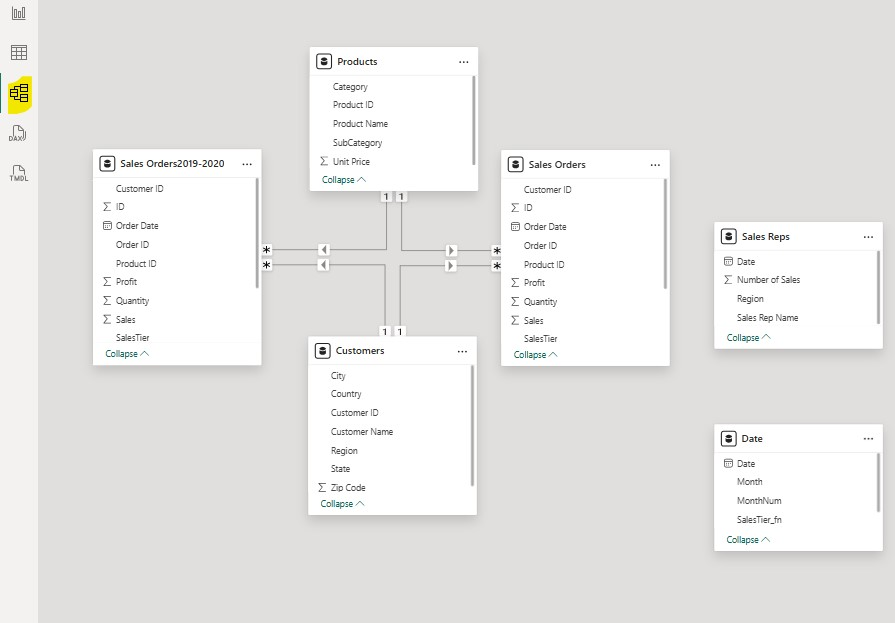

**Step 3.2:** Review existing auto-detected table connections between dimensions and fact tables.

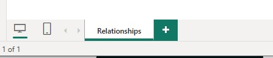

**Step 3.3:** Open **Manage Relationships** to inspect active and inactive model keys across tables.

**Step 3.4:** Identify missing customer ID connections between `Sales Orders` and the `Customer` table.

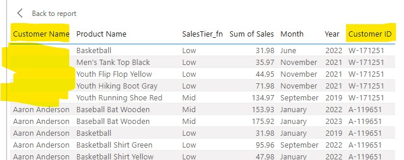

**Step 3.5:** Configure the primary relationship between `Date[Date]` and `Sales Orders[Order Date]`, confirming 1-to-many cardinality.

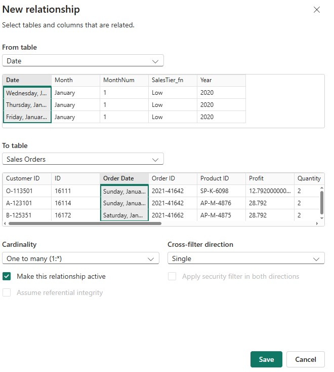

**Step 3.6:** Set the relationship to active to establish primary filter propagation paths across the model.

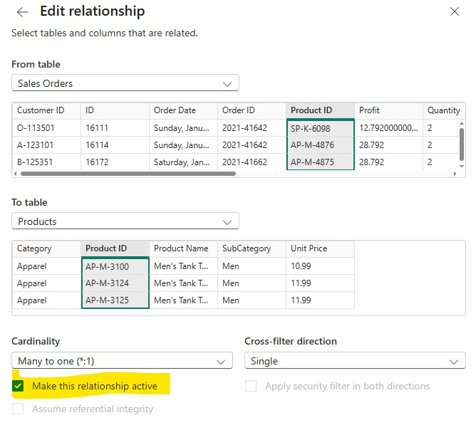

**Step 3.7:** Confirm the completed date-to-fact relationship setup in the visual schema editor.

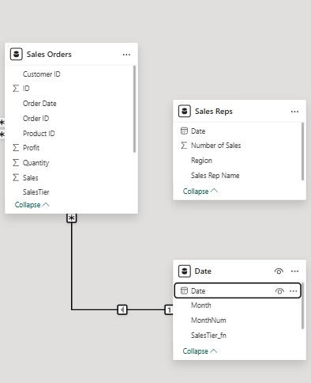

**Step 3.8:** Adjust relationship cardinality settings to maintain strict reference integrity between dimensions and facts.

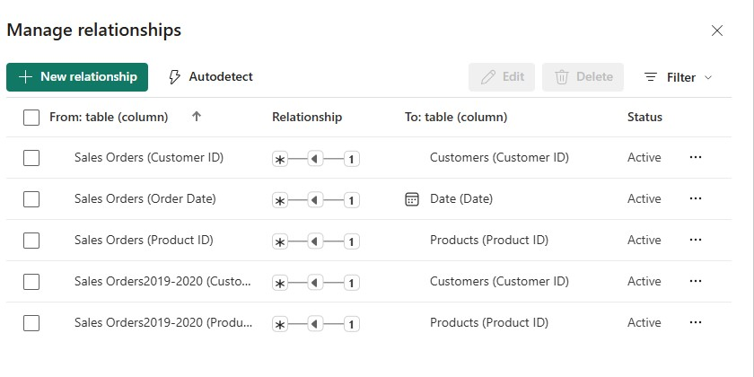

---

### 4️⃣ Data Categorization & Model Formatting

**Step 4.1:** Highlight geographic fields in the Data Pane and set the **Data Category** to **City** for map visualization support.

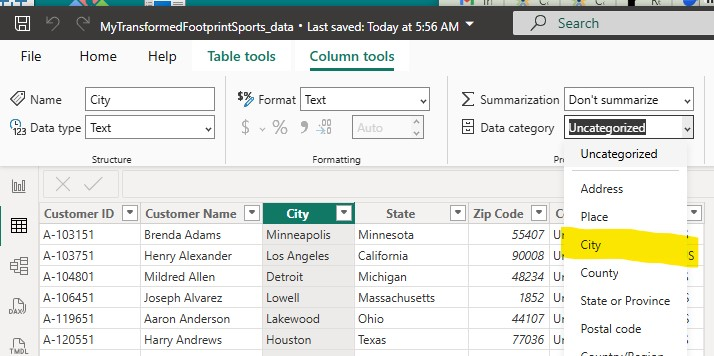

**Step 4.2:** Confirm updated data categories across the Home ribbon Modeling tab.

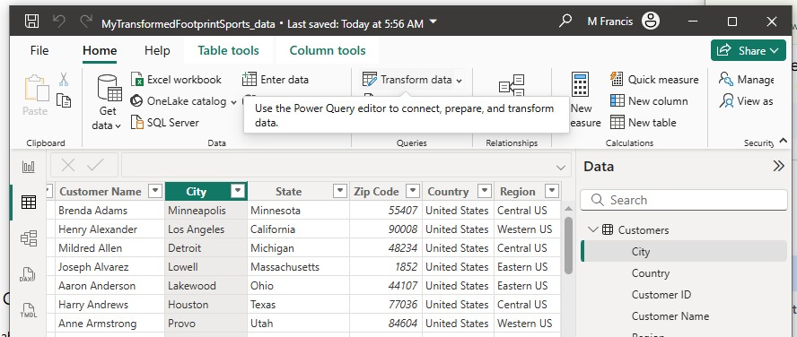

**Step 4.3:** Format revenue metrics (`Sales`, `Profit`, `Shipping Cost`) as **Currency** with fixed decimal places.

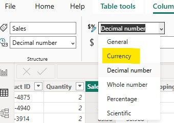

**Step 4.4:** Apply standardized calendar date formatting (`yyyy-MM-dd`) to all model date fields.

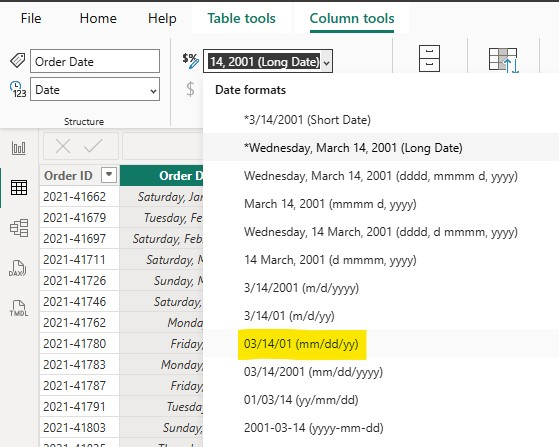

**Step 4.5:** Set `DaysToShip` field properties to **Don't Summarize** to prevent improper default summation in visuals.

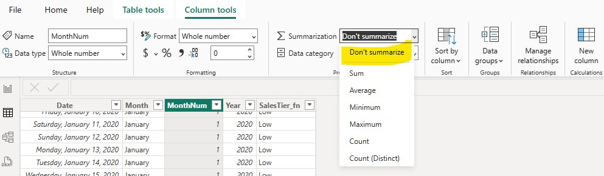

**Step 4.6:** Extract year attributes from date keys for reporting slicers and date grouping.

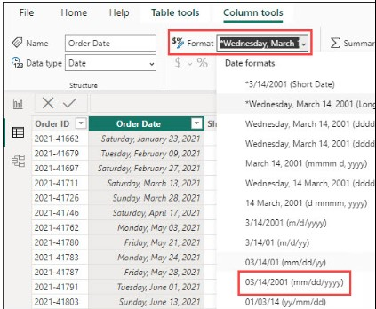

**Step 4.7:** Add numerical month ordering keys (`MonthNum`) to enforce correct chronological sorting of month names.

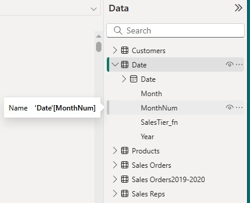

**Step 4.8:** Validate system date values to ensure accurate evaluation in reporting visuals.

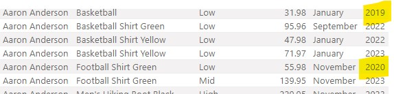

---

### 5️⃣ Preparing Data for Modeling & Visual Reporting Validation

**Step 5.1:** Navigate to the Report View tab to begin building presentation visuals.

**Step 5.2:** Insert a new visual container on the canvas page.

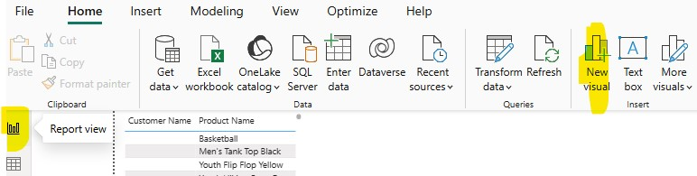

**Step 5.3:** Select the **Table Visual** icon from the Visualizations pane.

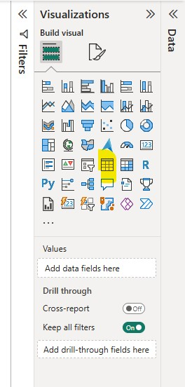

**Step 5.4:** Populate the table visual with `Sales`, `Profit`, and `Shipping Cost` fields to inspect output metrics.

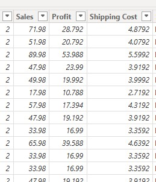

**Step 5.5:** Apply currency formatting to the aggregated table columns.

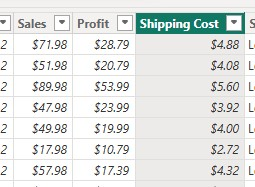

**Step 5.6:** Double-click and add `DaysToShip` to the table visual fields list.

**Step 5.7:** Confirm that `DaysToShip` resolves accurately alongside sales metrics in the visual grid.

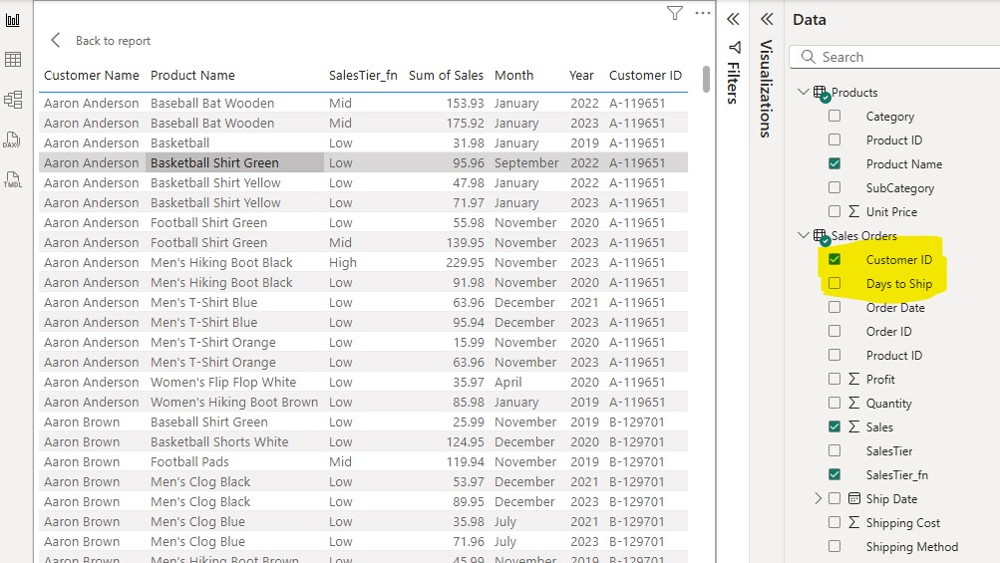

**Step 5.8:** Verify the canvas output after placing customer attributes and order metrics.

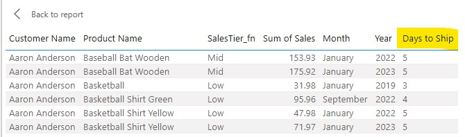

**Step 5.9:** Click **Focus Mode** on the visual header to expand the table for detailed validation.

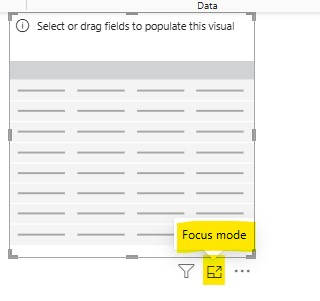

**Step 5.10:** Evaluate customer and product matrix combinations in focus view.

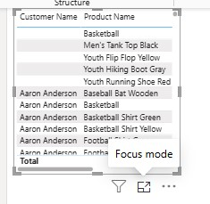

**Step 5.11:** Uncheck unneeded record IDs to clean up visual field displays.

**Step 5.12:** Modify product details within the table visual fields.

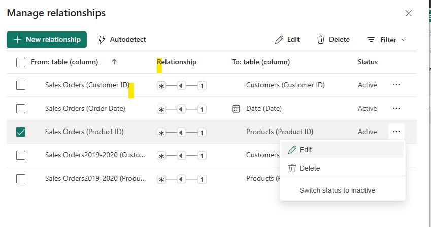

**Step 5.13:** Verify overall data integrity on the report canvas after completing field selections.

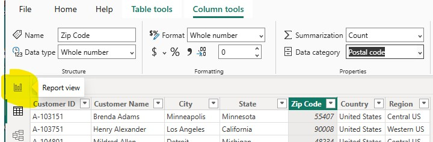

**Step 5.14:** Return to the report view layout after validating date-ship calculations.

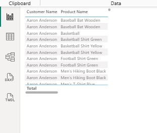

**Step 5.15:** Review the completed table visual grid displaying customer names, products, and formatted metrics.

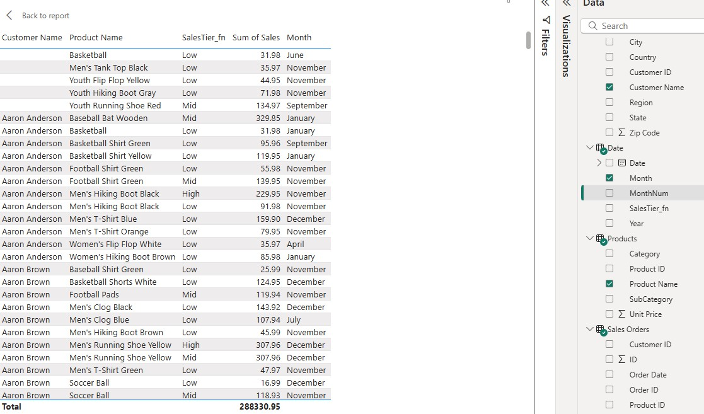

**Step 5.16:** Return to the primary report canvas layout.

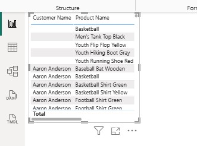

**Step 5.17:** Finalize the report layout, confirming that all relationships, formatting rules, and measures render expected results.

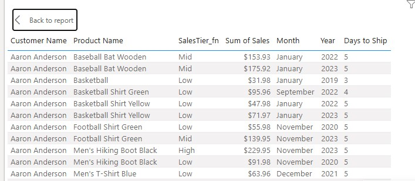

---

## 💡 Key Architectural Takeaways

* **Appended Multiple Datasets:** Stacking historical sales files into a unified table provides a scalable data foundation without duplicating transformation logic.
* **Aligned Schemas Across Tables:** Matching column structures ensures seamless union operations without producing redundant null columns or type conflicts.
* **Applied Transformations:** Cleaning errors, standardizing data types, and calculating duration columns in Power Query reduces downstream modeling overhead.
* **Prepared Data for Modeling and Reporting:** Proper relationship keys, cardinality definitions, geographic categorization, and currency formatting guarantee accurate visual cross-filtering and professional report delivery.

---

## 🔗 Related Links & Steps

* ⬅️ **Previous Step:** [3️⃣ Advanced Editor & Custom Functions in M](./query_advanced_editor_customFun-3.md)
* ➡️ **Next Step:** [5️⃣ DAX Calculations & Measures](./DAX_Calculations_Measures-5.md)
* 🏠 **Main Repository:** [Power BI Analysis Repo](https://github.com/yourexodus/mfrancis_PowerBI_Analysis)
