# Government Employment Analysis (Power BI)

## Overview
This project analyzes **U.S. government employment trends** using data from the Bureau of Labor Statistics (BLS). The focus is on **data preparation, time-series accuracy, and clear analytical storytelling** using Power BI.

This is not an interactive dashboard.  
Instead, it documents the **step-by-step analytical process** used to build a correct and trustworthy visualization.

---

## Data Source
- **Source:** U.S. Bureau of Labor Statistics (BLS)
- **Method:** Web data connector in Power BI
- **Frequency:** Monthly employment data
- **Scope:** U.S. Government employment

---

## Step 1: Data Acquisition

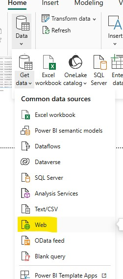

Data was retrieved directly from the BLS website using Power BI’s **Web connector**.

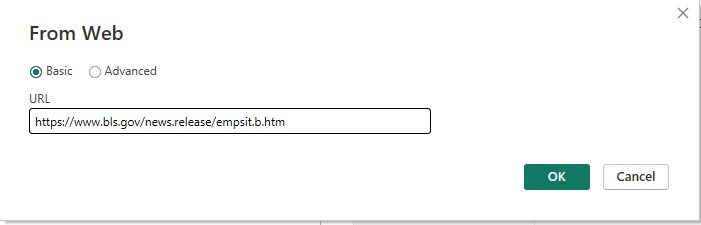

After pasting the source URL, the data preview was reviewed before loading.

---

## Step 2: Data Review & Initial Cleanup

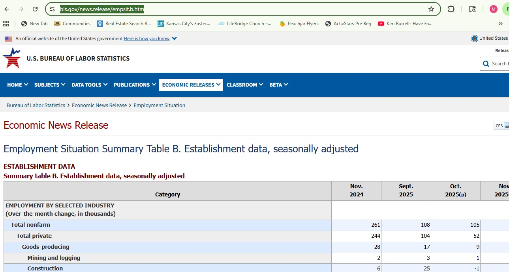

Initial inspection identified:
- Unnecessary columns
- Formatting inconsistencies
- Month values requiring transformation

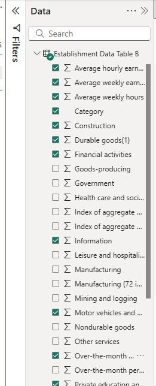

Only relevant U.S. employment data was retained.

---

## Step 3: Data Transformation (Power Query)

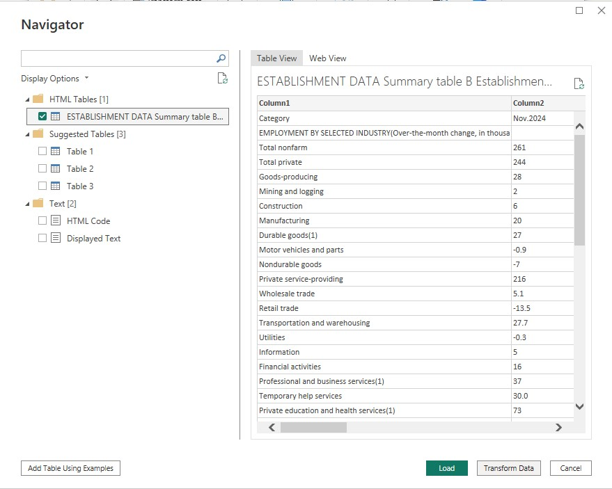

Power Query was used to reshape and clean the dataset.

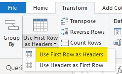

Headers were promoted to ensure proper field names.

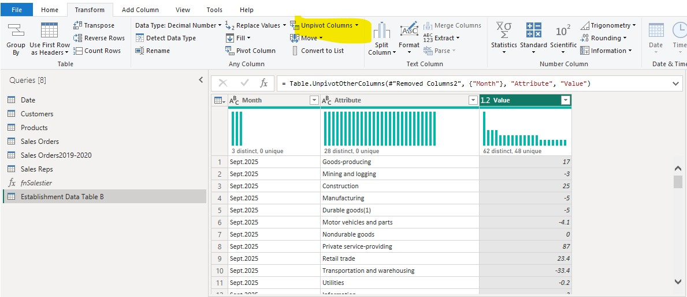

Wide-format data was unpivoted to support time-series analysis.

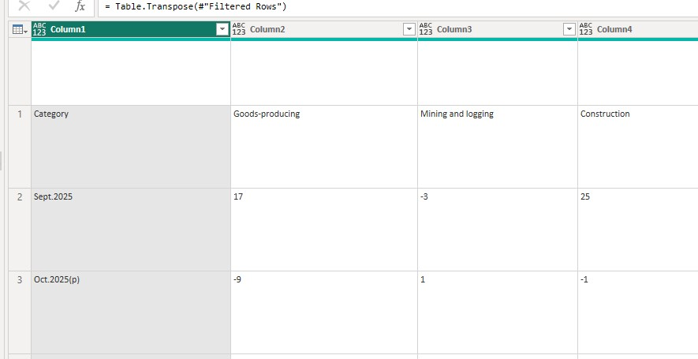

Data structure was validated after transformation.

---

## Step 4: Date & Category Corrections

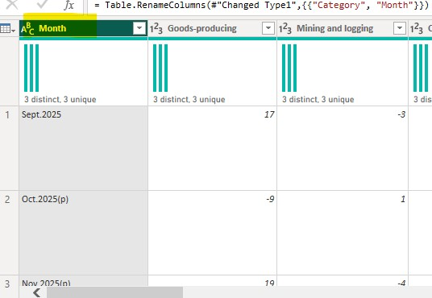

Month values were renamed for clarity.

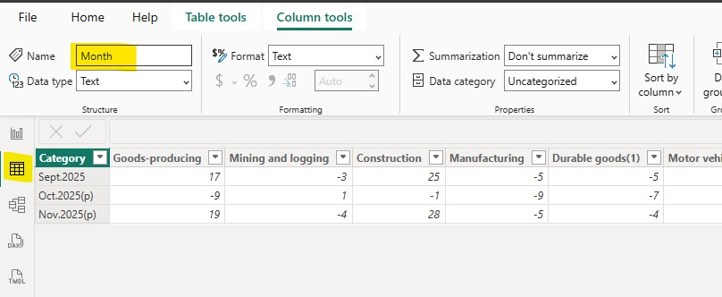

Month fields were explicitly set for time-based analysis.

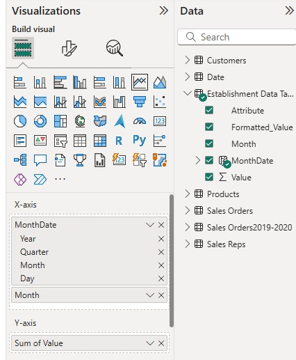

A proper date field was applied to the X-axis to prevent misordering.

> Correct month sorting is critical. Even correct data can appear misleading if dates are not handled properly.

---

## Step 5: Building the Visualization

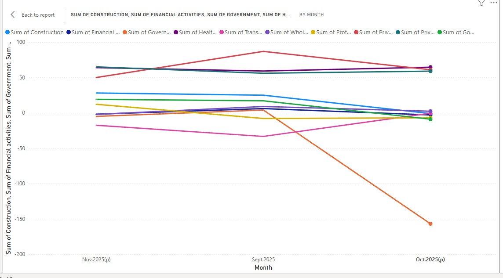

A line chart was selected to show employment trends over time.

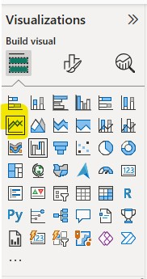

Government employment was added as the primary value.

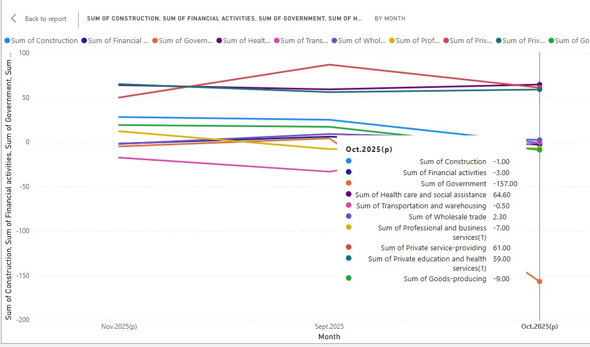

Aggregation was verified to ensure **SUM**, not average.

---

## Step 6: Formatting & Visual Emphasis

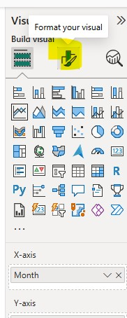

Formatting controls were used to guide viewer attention.

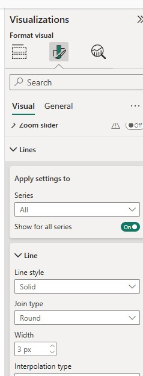

Government employment was emphasized using color and line weight.

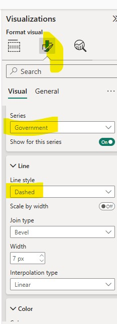

Other series were visually muted to reduce noise.

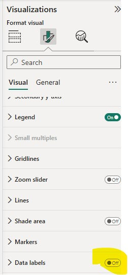
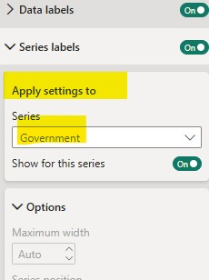

Labels were applied selectively to improve readability.

---

## Step 7: Key Observation

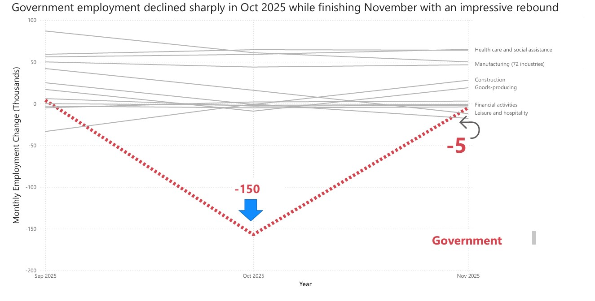

A noticeable decline appears from **September to October**, followed by a **November rebound**.

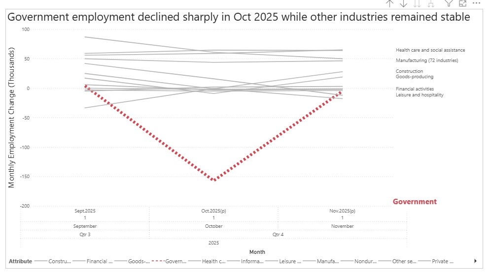

### Interpretation Notes
- This does **not automatically indicate layoffs**
- Possible explanations include:
  - End-of-fiscal-year adjustments
  - Temporary hiring pauses
  - Budget timing effects

Contextual analysis is required before drawing conclusions.

---

## Skills Demonstrated
- Power BI data shaping
- Power Query transformations
- Time-series accuracy
- Visual storytelling
- Responsible labor data interpretation

---

## Portfolio Context
This project demonstrates my ability to:
- Clean and reshape real-world labor data
- Correct common visualization mistakes
- Explain trends without overstatement
- Communicate findings clearly and professionally

---

## Repository
`mfrancis_PowerBI_Analysis`