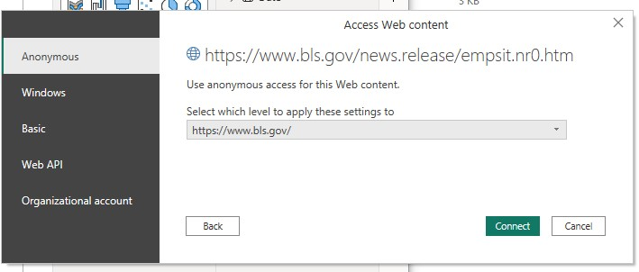
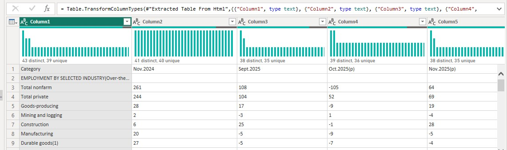
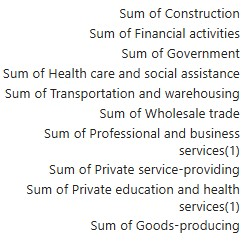
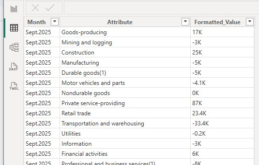
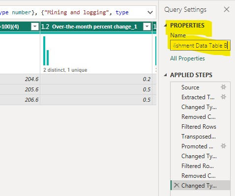
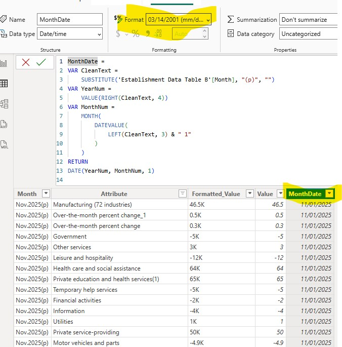
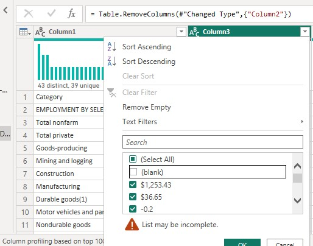
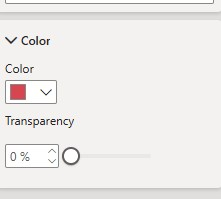
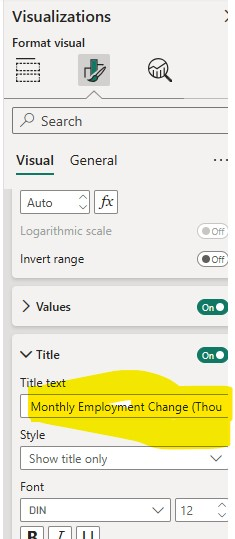
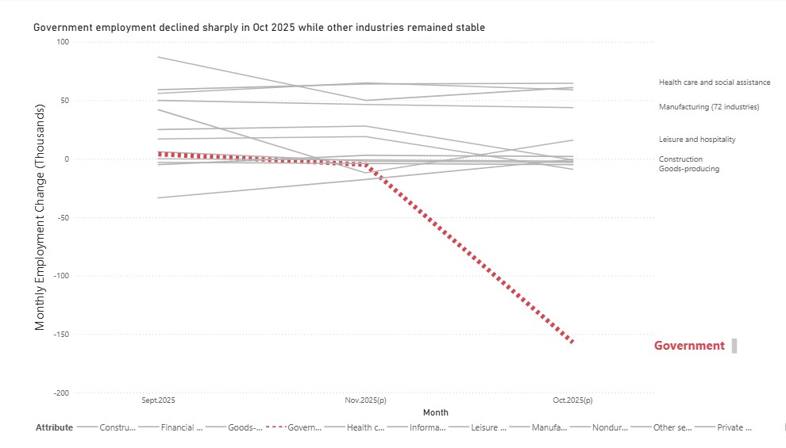

# Government Employment Analysis (Power BI)

## Overview
This project documents a **step-by-step Power BI analysis** of U.S. government employment data from the Bureau of Labor Statistics (BLS).

The purpose of this project is to:
- Practice **real-world data acquisition**
- Perform **data shaping and transformation**
- Correct common **time-series visualization issues**
- Interpret employment changes responsibly

This is a **process-focused analysis**, not just a final chart.

---

## Data Source
- **Source:** U.S. Bureau of Labor Statistics (BLS)
- **Access Method:** Power BI Web Connector
- **Frequency:** Monthly
- **Scope:** U.S. Government employment data

---

## Step 1: Connect to the Data Source

Power BI’s **Web connector** was used to access employment data directly from the BLS website.

The source URL was pasted and previewed to verify the correct table before loading.

Connections were accepted to allow Power BI to retrieve the dataset.

---

## Step 2: Review the Raw Data

Initial inspection revealed:
- Multiple header rows
- Extra metadata
- Wide-format monthly columns

Only the U.S. employment table was relevant for this analysis.

---

## Step 3: Open Power Query for Transformation

Power Query was used to clean and reshape the dataset.

The first row was promoted to headers for proper field naming.

---

## Step 4: Remove Unnecessary Data

Only relevant columns were retained.

Unneeded value columns were removed to simplify the dataset.

---

## Step 5: Reshape the Data (Unpivot)

Monthly columns were unpivoted to convert the data into a **long format** suitable for time-series analysis.

The resulting structure created:
- One column for Month
- One column for Employment values

---

## Step 6: Clean and Rename Fields

Tables were renamed for clarity.

Month categories were renamed to improve readability.

Month fields were explicitly assigned as date-related values.

---

## Step 7: Fix Date & Sorting Issues

A proper Date column was created.

The X-axis was updated to use a true date field instead of text.

Blank or incomplete month values were removed to prevent chart distortion.

> Correct time-series sorting is critical. Incorrect month order can mislead viewers even when data is accurate.

---

## Step 8: Build the Visualization

A **line chart** was selected to show employment trends over time.

Government employment was added to the Values field.

Aggregation was verified to ensure values were summed correctly.

---

## Step 9: Format for Clarity and Focus

Formatting options were accessed to refine the visual.

Government employment was emphasized using bold red formatting.

Other series were visually de-emphasized.

Line styles were adjusted to guide attention.

---

## Step 10: Labels, Titles, and Readability

Data labels were turned off globally.

Labels were selectively enabled for the focus series.

Titles and explanatory text were added to improve interpretation.

---

## Step 11: Final Result & Key Observation

The final visualization shows:
- A **decline from September to October**
- A **rebound in November**

### Interpretation
This decline does **not automatically indicate layoffs**.  
Possible explanations include:
- End-of-fiscal-year adjustments
- Temporary hiring pauses
- Budget or funding cycle timing

Context is essential when interpreting employment data.

---

## Skills Demonstrated
- Power BI Web data ingestion
- Power Query transformations
- Time-series correction
- Visual storytelling
- Responsible labor market interpretation

---

## Portfolio Context
This project reflects my ability to:
- Document analytical workflows clearly
- Preserve data integrity
- Communicate insights professionally
- Explain complex trends without exaggeration

---

## Repository
`mfrancis_PowerBI_Analysis`
