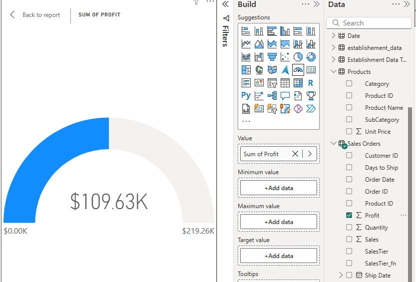
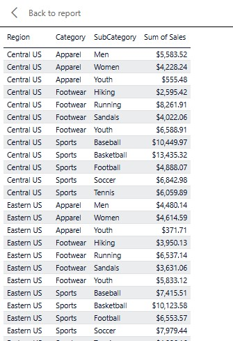
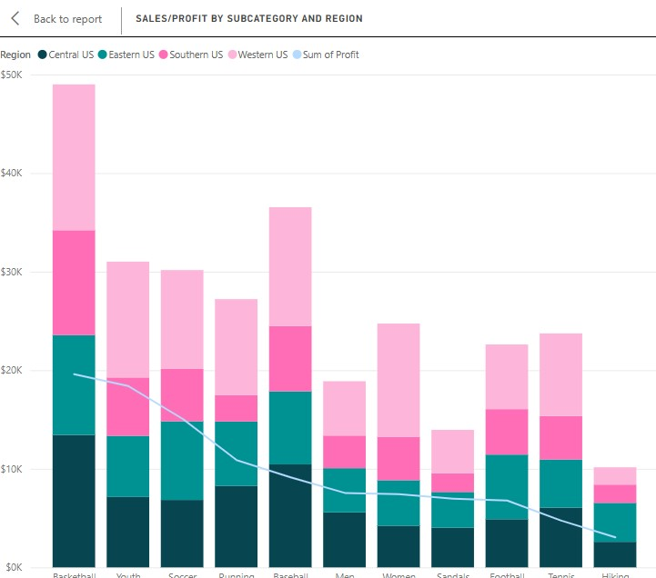
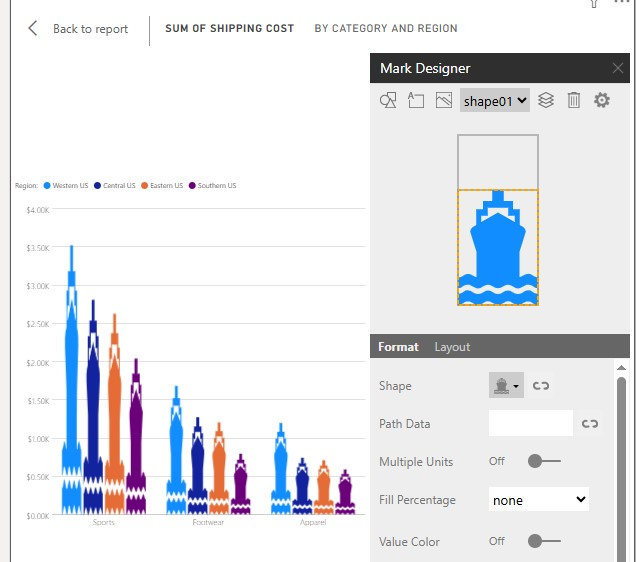
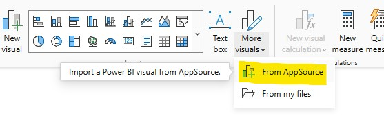
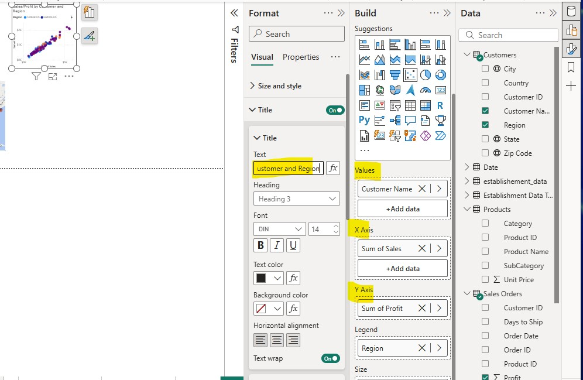
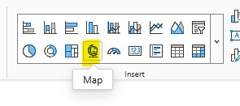
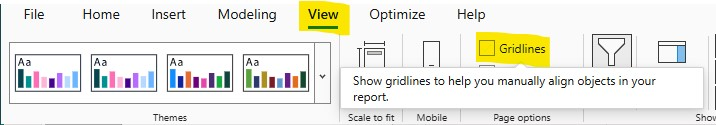
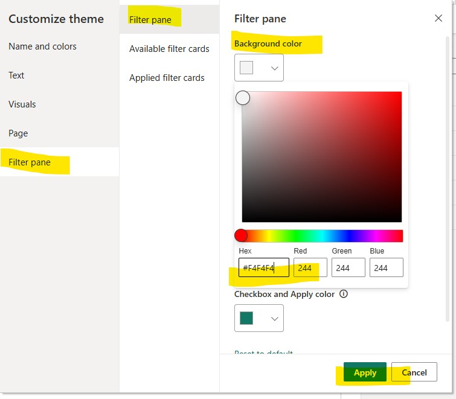

# 📈 Outcome & Final Data Delivery (Step 6)

## 📌 Core Summary

The data transformation, profiling, and modeling pipeline for the footprint analysis project is now complete. The resulting analytical ecosystem delivers a fully optimized model built for reporting and executive decision-making.

### Key Milestones Achieved
* **Cleaned & Standardized:** All raw sales, customer, and product records undergo schema alignment, data type enforcing, and key validation.
* **Profiled for Quality Assurance:** Error records are isolated and removed, key cardinalities (1-to-many) are verified, and referential integrity is guaranteed across dimensions.
* **Optimized via Reusable Logic:** Custom M functions standardizing column naming, date math calculations (`DaysToShip`), and data casing streamline query refresh performance.
* **Ready for BI Modeling & Visualization:** Fully formatted metrics (currency, calendar dates, non-aggregating counters) are mapped to interactive canvas visuals and custom visual extensions.

---

## 🖼️ Final Deliverables & Visual Artifacts

### 1️⃣ Core Metrics & Visual Aggregations

**Gauge Visual & KPI Targets**
Aggregated profit metrics mapped to targeted gauge visuals to track progress against dynamic sales goals.

**Sorted Sales & Region Matrices**
Standardized regional reporting sorted by sub-category performance across Central and Eastern territories.

**Profit vs. Revenue Distribution**
Stacked column and trend line visual tracking regional contribution against overall profit margins.

---

### 2️⃣ Advanced & Custom Visualizations

**Custom Infographic Marks**
Custom infographic visual configurations using custom shapes to highlight shipping cost metrics by category.

**AppSource Visual Integrations**
Importing custom visuals from AppSource to extend native Power BI capabilities.

**Customer Segment Scatter Analysis**
Scatter plot correlation mapping individual customer purchasing volume against net profitability by region.

---

### 3️⃣ Geographic & UX Theme Enhancements

**Map Visual Controls**
Initializing spatial map visualizations to plot customer distribution across states and zip codes.

**Canvas Alignment & Gridlines**
Enabling gridline guides in the View tab to enforce visual hierarchy and precise element alignment.

**Theme & Color Customization**
Applying custom Hex theme properties (`#F4F4F4`) to filter panes and visual containers to ensure contrast compliance.

---

## 🛠️ Complete Asset Inventory

The project repository includes a complete catalog of dataset screenshots, step-by-step UI captures, and model audit records:

---

## 💡 Key Architectural Takeaways

* **Data Integrity First:** Comprehensive ETL transformation eliminates downstream visual errors and reporting discrepancies.
* **Scalable Modeling:** Star-schema design with optimized relationships supports fast DAX evaluation and responsive cross-filtering.
* **User-Centric Design:** Formatted visual elements, accessible theme palettes, and interactive drill-downs empower intuitive self-service analytics.

---

## 🔗 Repository Navigation

* ⬅️ **Previous Step:** [4️⃣ Data Shaping & Model Building](./Data_Shaping-4.md)
* 🏠 **Main Repository:** [Power BI Analysis Repo](https://github.com/yourexodus/mfrancis_PowerBI_Analysis)
