# 📊 Power BI Data Preparation & Transformation Portfolio
## Marlainna Francis — Data Analyst

---

## 🔍 Project Overview
This repository documents my **end-to-end Power BI data preparation workflow**, demonstrating how raw, unstructured data is transformed into **analysis-ready datasets** using Power BI and Power Query.

The project follows a structured analytics lifecycle used in real-world business intelligence and analytics roles, including data connection, profiling, custom function creation, and data shaping.

---

## 🎯 Project Objectives
- Connect to raw data sources in Power BI  
- Reformat headers and columns for consistency  
- Profile datasets using descriptive statistics  
- Build reusable **custom Power Query functions**  
- Append, transform, and shape data for reporting  
- Prepare clean datasets for modeling and visualization  

---

## 🛠 Tools & Technologies
- **Power BI Desktop**
- **Power Query (M language)**
- **Advanced Query Editor**
- **Excel / CSV data sources**
- **GitHub** (documentation & version control)

---

## 🔄 End-to-End Workflow

### 1️⃣ Connect Data & Reformat Columns
📄 Documentation:  
https://github.com/yourexodus/mfrancis_PowerBI_Analysis/blob/main/ConnectData_Reformat_Headers_columns-1.md

- Connected raw data sources into Power BI  
- Standardized column headers  
- Reformatted column data types  
- Prepared datasets for downstream transformations  

---

### 2️⃣ Data Profiling & Statistics
📄 Documentation:  
https://github.com/yourexodus/mfrancis_PowerBI_Analysis/blob/main/DataProfiling_Statistics-2.md

- Profiled datasets using Power BI data profiling tools  
- Reviewed nulls, uniqueness, and distributions  
- Analyzed descriptive statistics  
- Identified data quality issues  

---

### 3️⃣ Custom Functions (Advanced Query Editor)
📄 Documentation:  
https://github.com/yourexodus/mfrancis_PowerBI_Analysis/blob/main/query_advanced_editor_customFun-3.md

- Built reusable Power Query custom functions  
- Used M language in the Advanced Query Editor  
- Reduced repetitive transformations  
- Improved scalability and maintainability  

---

### 4️⃣ Data Shaping: Appending & Transforming
📄 Documentation:  
https://github.com/yourexodus/mfrancis_PowerBI_Analysis/blob/main/Data_Shaping-4.md

- Appended multiple datasets  
- Aligned schemas across tables  
- Applied transformations  
- Prepared data for modeling and reporting  

---

## 📈 Outcome
The final datasets are:
- Cleaned and standardized  
- Profiled for quality assurance  
- Optimized through reusable functions  
- Ready for BI modeling and visualization  

---

## 🧠 Skills Demonstrated
- Power BI data preparation  
- Power Query & M language  
- Data profiling and quality assessment  
- Custom function development  
- Data transformation and shaping  

---

## 🔗 Related Links
- 🌐 Portfolio Site: https://yourexodus.github.io/MarlainnaTheAnalyst/  
- 📊 Power BI Analysis Repo: https://github.com/yourexodus/mfrancis_PowerBI_Analysis  
- 📺 YouTube: @IKnowHowToSkills

## 🚀 My Technology Journey

```mermaid
flowchart TD

A["1999–2004<br/>Associated Wholesale Grocers<br/><br/>IBM Mainframe Programmer<br/><br/>COBOL • CICS • JCL • DB2 • ESP • SDLC"]
-->
B["2004–2008<br/>State Street Corporation<br/><br/>IBM Mainframe Programmer<br/><br/>Financial Systems<br/>COBOL • CICS • DB2 • JCL"]

-->
C["2008–2010<br/>DST Systems<br/><br/>IBM Mainframe Programmer<br/><br/>Production Support<br/>Batch Processing<br/>Enterprise Operations"]

-->
D["2010–2018<br/>Customer & IT Support<br/><br/>Sprint<br/>Robert Half<br/>Modis Consulting<br/><br/>PowerShell<br/>Active Directory<br/>Infrastructure"]

-->
E["2020–Present<br/>Intuit<br/><br/>Senior Bookkeeping Expert<br/><br/>Business Operations<br/>Financial Systems<br/>Customer Analytics"]

-->
F["2022–2023<br/>Data Science Bootcamp<br/><br/>Machine Learning<br/>Python<br/>Scikit-learn<br/>Databricks<br/>ETL<br/><br/>Diabetes Prediction App<br/>87% ROC AUC"]

-->
G["2025–Present<br/>Your Exodus Platform<br/><br/>Python<br/>Flask APIs<br/>PostgreSQL<br/>Docker<br/>JavaScript<br/><br/>Journal<br/>Prayer<br/>Bible Study"]

-->
H["2025–Present<br/>Analytics Portfolio<br/><br/>Power BI<br/>SQL<br/>Python<br/>Tableau<br/>Machine Learning<br/>Plotly Dash"]

-->
I["Career Vision<br/><br/>Enterprise Technology Analyst<br/>Application Modernization<br/>Data & AI Transformation<br/>Business Systems Analyst"]
```

---

### 💡 Technology Evolution

| Career Stage                 | Primary Skills                              | Representative Projects                        |
| ---------------------------- | ------------------------------------------- | ---------------------------------------------- |
| **Enterprise Systems**       | COBOL, CICS, JCL, DB2                       | Retail, Financial Services, Batch Processing   |
| **Infrastructure & Support** | PowerShell, Active Directory, Networking    | Applebee's EMV Deployment, Tier 2 Support      |
| **Business Operations**      | QuickBooks, Financial Analysis, Escalations | Intuit Customer Success & Financial Operations |
| **Data Science**             | Python, Scikit-learn, Databricks            | Diabetes Prediction Application                |
| **Software Engineering**     | Flask, REST APIs, PostgreSQL, Docker        | Your Exodus Platform                           |
| **Analytics**                | Power BI, SQL, Tableau, Plotly Dash         | Data Analytics Portfolio                       |
| **Future Direction**         | Enterprise Architecture, AI, Modernization  | Legacy Systems + Modern Data Solutions         |

> **Career Mission**
>
> *Bridging legacy enterprise systems, business operations, modern software engineering, data analytics, and AI to build intelligent technology solutions.*

---

## 📬 Contact
**Marlainna Francis**  
Data Analyst | Analytics & Technical Operations  
GitHub: https://github.com/yourexodus  
  
