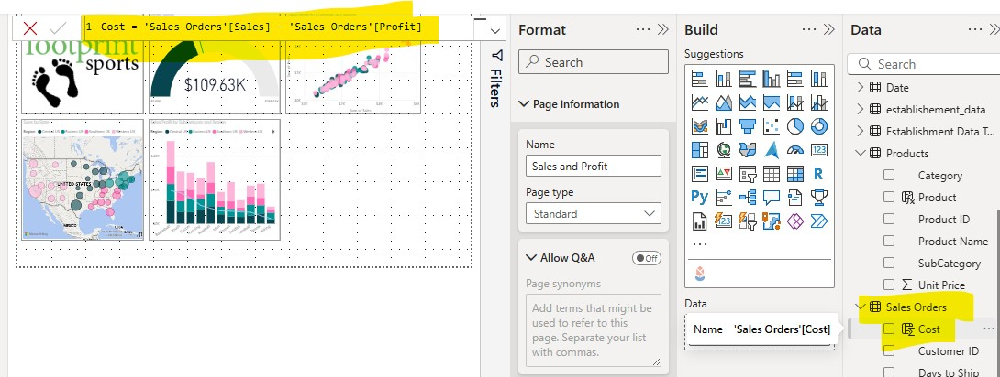

# Module 1: The Power BI Sales & Profit Masterclass
**Subtitle:** A Step-by-Step Guide to Professional Data Storytelling & DAX  
**Author:** Marlainna Francis

---

## 1. Introduction: The Business Case
In this project, we transform raw sales data into a recruiter-ready dashboard. We don’t just build charts; we solve business problems by analyzing profit margins, regional growth, and product performance.

**Project Goals:**
- Master the Modern Power BI UI (On-object interaction)
- Write and implement DAX Calculated Fields
- Design for Accessibility using Colorblind Safe themes
- Deploy Advanced Visuals (Infographic Designer & Geospatial Maps)

---

## 2. Technical Foundation: Data Modeling & DAX

### Step 1: Field Validation
We start by validating the Products table to ensure data integrity.

### Step 2: DAX Logic for Profitability
To understand the business's bottom line, we create a custom **Cost** measure:

**Logic:** `Cost = [Sales] - [Profit]`  
**Format:** All financial fields are set to Currency ($) to ensure business readiness.

---

## 3. The Visualization Suite

### A. Performance Tracking (Combo Charts)
We use a Line and Clustered Column Chart to compare **Sales vs. Profit**.

**Insight:** By sorting by **Sum of Profit**, we immediately identify which subcategories are "Revenue Leaders" vs. "Profit Drainers."

### B. Geospatial Intelligence (Map Visuals)
We enabled the map feature to visualize **regional performance**.

**Pro Tip:** Custom Tooltips reveal detailed breakdowns of Category sales when hovering over a state without cluttering the dashboard.

### C. Executive Overviews (Gauge & Targets)
Set a **Profit Target** of $120,000. The Gauge visual provides an instant "Red/Green" status on company goals.

---

## 4. Advanced Design: Infographics & UX
Use the **Infographic Designer** from AppSource to create visually engaging elements.

**The "Boat" Visual:** Transportation icons represent shipping costs, making the data intuitive.

---

## 5. Final Polish & Professional Standards

**Accessibility:** Applied a **Colorblind Safe Palette** to ensure the dashboard is usable for all executives.  
**Layout:** Used gridlines for symmetrical spacing and alignment.  
**Final Output:** A cohesive, single-page dashboard tracking **Total Sales by Region, Category, and SubCategory**.

---

## 6. Key Takeaways
- Visual field placement directly impacts formatting options  
- Power BI’s **Suggested visuals** accelerate exploratory analysis  
- UI updates require adaptability when following older guides  
- Structured documentation enhances portfolio credibility  

---

## 7. Author
**Marlainna Francis**  
Data Analyst | Business Intelligence | Analytics  

🌐 Portfolio: [yourexodus.github.io/MarlainnaTheAnalyst](https://yourexodus.github.io/MarlainnaTheAnalyst/)  

