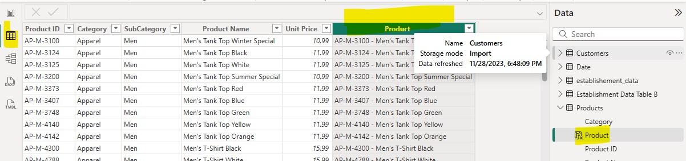
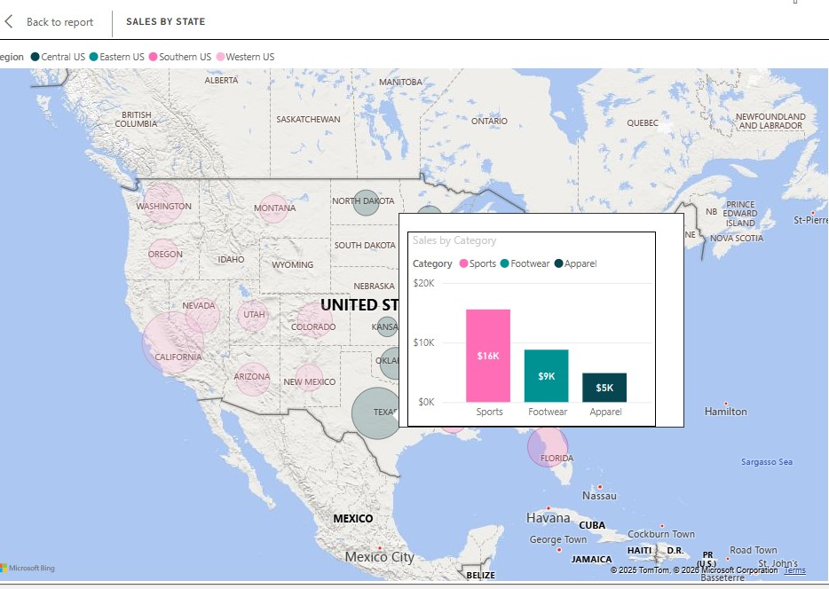
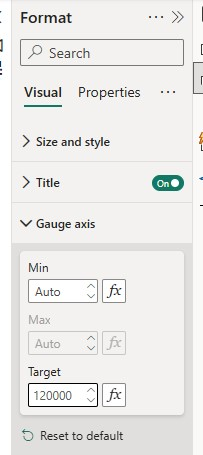
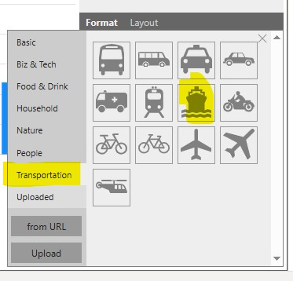
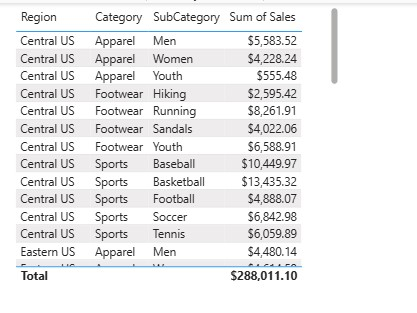
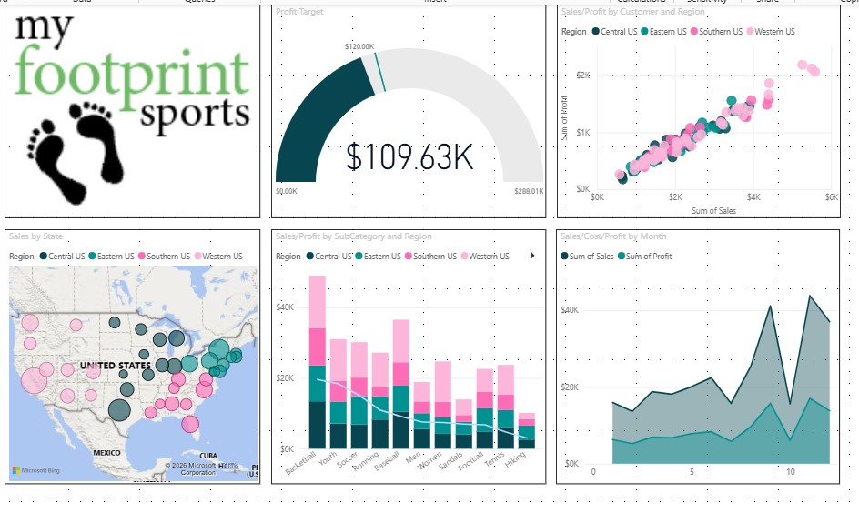

# Power BI Sales & Profit Masterclass
**Subtitle:** A Step-by-Step Guide to Professional Data Storytelling & DAX  
**Author:** Marlainna Francis  

---

## 🎯 Learning Objectives
By completing this project, you will be able to:  
- Transform raw sales data into a professional, recruiter-ready dashboard  
- Create and implement profitability calculations  
- Build engaging reports using advanced Power BI visuals and infographics  
- Apply accessibility best practices for executive-friendly dashboards  

---

## 1. Introduction: The Business Case
This project focuses on solving real business problems, not just building charts. You’ll analyze profit margins, regional growth, and product performance to deliver actionable insights.

**Project Goals:**  
- Master the Modern Power BI UI (On-object interaction)  
- Implement calculated fields for profitability  
- Design for Accessibility using Colorblind Safe themes  
- Deploy Advanced Visuals (Infographics & Geospatial Maps)  

---

## 2. Technical Foundation: Data Modeling & Profitability
### Step 1: Field Validation
Validate the Products table to ensure data integrity before analysis.

### Step 2: Profitability Calculations
Create custom measures to analyze the business’s bottom line. For example, you can calculate **Cost** by subtracting **Profit** from **Sales**. All financial fields are formatted as Currency ($) for professional output.

---

## 3. The Visualization Suite

### A. Performance Tracking (Combo Charts)
Compare **Sales vs. Profit** using a Line and Clustered Column Chart.

**Insight:** Sorting by **Sum of Profit** highlights revenue leaders vs. profit drainers.

### B. Geospatial Intelligence (Map Visuals)
Visualize **regional performance** on a map.

**Pro Tip:** Custom tooltips display category-level sales without cluttering the dashboard.

### C. Executive Overviews (Gauge & Targets)
Set a **Profit Target** of $120,000. Gauge visuals instantly communicate performance status.

---

## 4. Advanced Design: Infographics & UX
Use the **Infographic Designer** to create visually engaging elements.

**Example:** "Boat" icons represent shipping costs intuitively.

---

## 5. Final Polish & Professional Standards
- **Accessibility:** Colorblind Safe Palette ensures usability for all executives  
- **Layout:** Gridlines create symmetry and alignment  
- **Final Output:** Single-page dashboard tracking **Total Sales by Region, Category, and SubCategory**

---

## 6. Key Takeaways
- Strategic field placement affects formatting and readability  
- Power BI’s suggested visuals accelerate exploratory analysis  
- Staying current with UI updates ensures professional-quality reports  
- Structured documentation boosts portfolio credibility  

---

## 7. Wrap-Up
You now have a **complete, recruiter-ready Power BI dashboard** suitable for portfolio inclusion or business use.

---

## 8. Buy Now
Take the course today and master Power BI with this real-world projects!  

**[👉 Buy Now on Gumroad](https://marlainna.gumroad.com/l/owksat)**  

 

---

## 9. Author
**Marlainna Francis**  
Data Analyst | Business Intelligence | Analytics 
