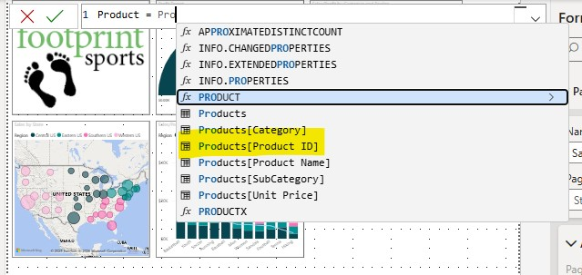
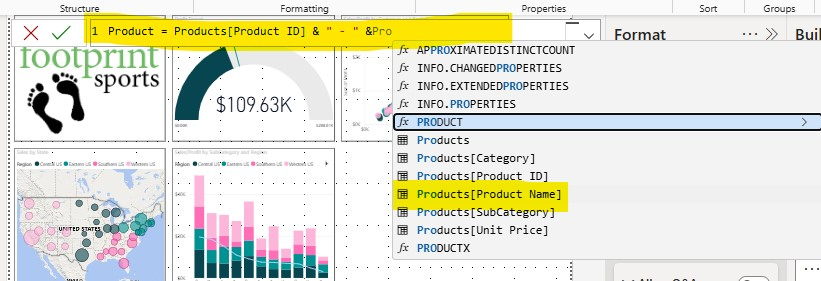
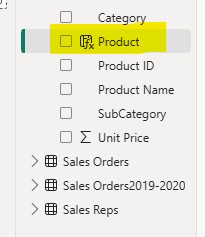
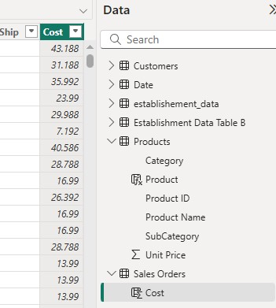
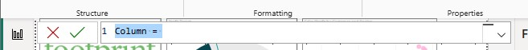
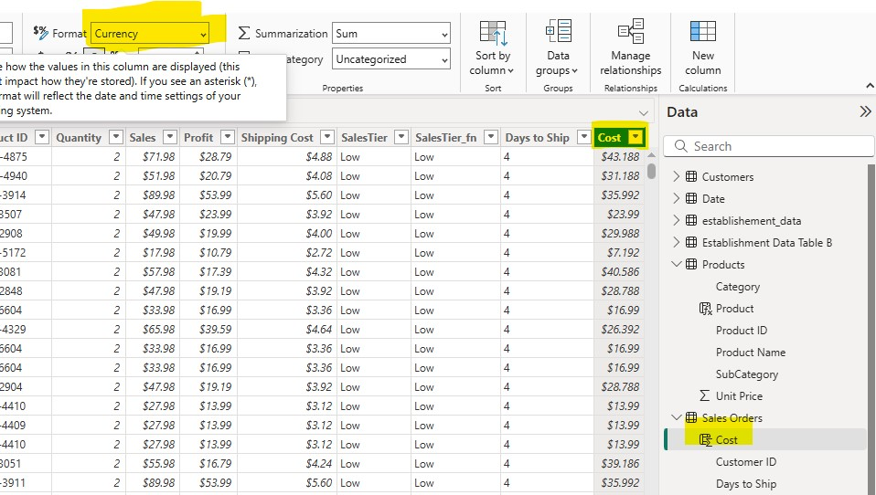
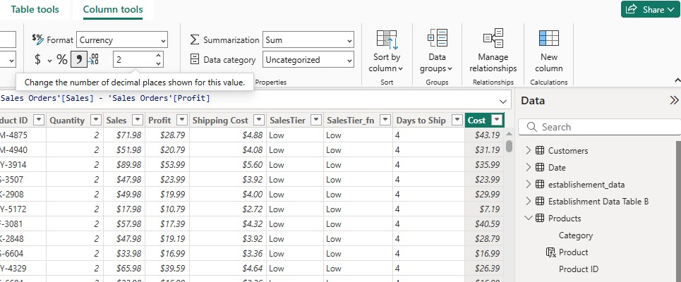
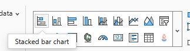
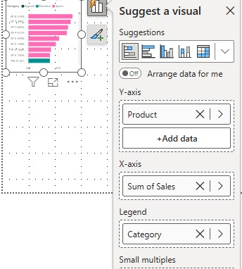
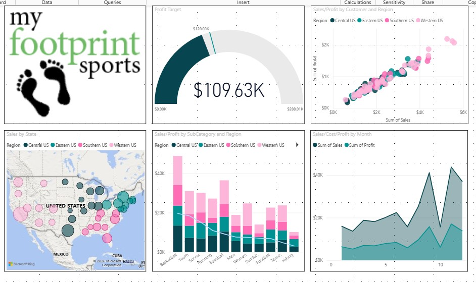

# Power BI Visualization & DAX Exploration Project

## 📊 Project Overview
This project showcases hands-on Power BI skills through interactive visual creation, formatting, and exploratory analysis using **Sales and Profit data**. It includes combo charts, suggested visuals, and category-based comparisons, with an emphasis on understanding Power BI’s modern interface and analytical workflow.

The project is documented using a public report, GitHub-hosted images, and structured markdown for portfolio presentation.

---

## 🎯 Objectives
- Create and format Power BI visuals using best practices
- Explore **Suggested visuals** and understand data-role mapping
- Compare Sales performance by Product and Category
- Apply formatting to improve clarity and contrast
- Publish analytics work in a recruiter-accessible format

---

## 🛠 Tools & Technologies
- **Power BI Desktop**
- **DAX (implicit measures & aggregations)**
- **GitHub** (documentation and image hosting)
- **Google Docs** (published report)

---

## 📈 Visualizations Included

### 1️⃣ Combo Chart: Sales vs Profit
- **X-Axis:** SubCategory  
- **Column Y-Axis:** Sum of Sales  
- **Line Y-Axis:** Sum of Profit  
- **Legend:** Region  
- **Visual Type:** Line and Clustered Column Chart  

This visual demonstrates proper axis assignment and formatting to clearly distinguish profitability trends from sales volume.

📁 Images stored in:
images_charting/

yaml
Copy code

---

### 2️⃣ Suggested Visual: Sales by Product and Category
Power BI’s **Suggest a visual** feature was used to explore alternative representations of the dataset.

- **Y-Axis:** Product  
- **X-Axis:** Sum of Sales  
- **Legend:** Category  

This visual helps quickly identify top-performing products and category distribution.

📁 Images stored in:
images_DAX/

yaml
Copy code

#### Example Visualization

> This visual highlights how categorical grouping affects sales interpretation and demonstrates Power BI’s automatic visual recommendations.

---

## 🧮 DAX & Measures Notes
- Sales and Profit are aggregated using **implicit measures** (Sum)
- Visual behavior changes based on measure placement (X/Y-axis roles)
- Power BI’s formatting options vary by visual type and UI version

This reinforces the importance of understanding **semantic model behavior**, even without custom DAX measures.

---

## 🖼 Project Images
All screenshots and visuals used in this project are organized into clearly labeled folders:

images_charting/ → Combo charts and formatting visuals
images_DAX/ → Suggested visuals and category/product analysis

yaml
Copy code

This structure mirrors real-world analytics documentation practices.

---

## 📄 Published Report
The full walkthrough, explanations, and visuals are available here:

🔗 **Published Google Doc**  
https://docs.google.com/document/d/e/2PACX-1vRzCm8RpqCNMi6-PjiWiCsDbZQoLWPQd12uR3bcsrMBDfZAxsFJlrqXaGvW04YVC93QRo-EEKDnlW68/pub

---

## 💡 Key Takeaways
- Visual field placement directly affects formatting options
- Power BI’s **Suggested visuals** accelerate exploratory analysis
- UI changes require adaptability when following older labs
- Clear documentation improves portfolio credibility

---

## 📬 Author
**Marlainna Francis**  
Data Analyst | Business Intelligence | Analytics  

🌐 Portfolio: https://yourexodus.github.io/MarlainnaTheAnalyst/  
🐙 GitHub: https://github.com/yourexodus  

---

## 🚀 Notes
This project is part of ongoing analytics skill development and portfolio building, demonstrating Pow

## 🧱 Data Model Setup & Field Confirmation

Before building the combo chart, we verified and explored the structure of our Products table and key fields.

### 🔹 View Products Table – Data View

This screenshot shows the **Products** table in Power BI’s Data view, including Product ID, Product Name, Category, SubCategory, and pricing-related fields — the basis for downstream visuals.

### 🔹 Select Key Product Fields

We individually select:
- **Product ID** (primary key)
- **Product Name** (for labels)

These selections ensure correct field context before transformations.

### 🔹 Observe New Calculated Fields

These visuals show field creation results, confirming that calculated fields are visible and ready for use.

---

## 🧮 Calculated Fields & Cost Logic

Here are screenshots documenting how we created and formatted calculated fields used in the combo visuals:

### 🔹 Cost Logic & Formula

This step ensures that the **Cost** measure — an essential part of our analytics — is correctly calculated and available.

---

## 🎨 Formatting & Money Fields

Next, we applied formatting and ensured consistent currency display for financial measures.

### 🔹 Select Currency

### 🔹 Apply Currency Formatting

Formatting steps make the visualization clearer and ready for business interpretation.

---

## 📊 Visual Construction – Sales, Profit & Cost

Now we document the creation of the core visuals, starting with bar chart construction then expanding to a combo layout.

### 🔹 Click to Build Stacked Bar Chart

### 🔹 Build Stacked Bar Chart

These steps show how we began with bar chart placement before adding additional measures and axes.

### 🔹 Sales, Profit & Cost Graph Build

This screenshot shows the core combo chart being built — Sales bars alongside Profit lines and Cost context.

---

## 📤 Final Output & Dashboard

### 🔹 Post Dashboard View

This final image shows the completed dashboard with combined visuals and formatting applied — reflecting the final product of the steps documented in the published walkthrough.

---

## 📝 How This Matches the Published Walkthrough

Your Google Doc (published here):
🔗 https://docs.google.com/document/d/e/2PACX-1vRzCm8RpqCNMi6-PjiWiCsDbZQoLWPQd12uR3bcsrMBDfZAxsFJlrqXaGvW04YVC93QRo-EEKDnlW68/pub

lays out the process as:
1. Validate tables and key fields  
2. Create calculated fields  
3. Format measures  
4. Build base visuals (Sales & Profit combo)  
5. Refine titles, sort orders, and formatting  
6. Publish and interpret results  