# Power BI Visualization & DAX Exploration Project

## 📊 Project Overview
This project demonstrates hands-on **Power BI** skills through interactive visual creation, formatting, and exploratory analysis of **Sales and Profit data**. Key components include combo charts, suggested visuals, category-based comparisons, and a focus on Power BI’s modern interface and analytical workflow.  

All visuals and documentation are hosted via **GitHub images** and a **published Google Doc** to make the project recruiter-accessible.

---

## 🎯 Objectives
- Build and format Power BI visuals using best practices  
- Explore **Suggested visuals** and understand data-role mapping  
- Compare Sales performance by Product and Category  
- Apply formatting for clarity and business-readiness  
- Publish a structured analytics walkthrough for portfolio presentation  

---

## 🛠 Tools & Technologies
- **Power BI Desktop**  
- **DAX** (implicit measures & aggregations)  
- **GitHub** (image hosting/documentation)  
- **Google Docs** (published report)  

---

## 🧱 Data Model Setup & Field Confirmation
Before creating visuals, we validated key tables and fields to ensure proper context and accurate calculations.

### 🔹 View Products Table
  
Shows Product ID, Product Name, Category, SubCategory, and pricing-related fields.

### 🔹 Select Key Product Fields
  
  

**Selected fields:**  
- **Product ID** → primary key  
- **Product Name** → labels  

These steps ensure accurate field mapping before downstream calculations.

### 🔹 Observe New Calculated Fields
  
  

Calculated fields are created and ready for use in visuals.

---

## 🧮 Calculated Fields & Cost Logic
### 🔹 Cost Calculation
  
  
  

This ensures the **Cost** measure is accurate for combo chart analysis.

---

## 🎨 Formatting & Money Fields
### 🔹 Apply Currency Formatting
  
  
  

Formatted measures improve readability and business interpretation.

---

## 📊 Visualizations

### 1️⃣ Combo Chart: Sales vs Profit
- **X-Axis:** SubCategory  
- **Column Y-Axis:** Sum of Sales  
- **Line Y-Axis:** Sum of Profit  
- **Legend:** Region  
- **Visual Type:** Line and Clustered Column Chart  

📁 Images: `images_charting/`  

**Purpose:** Demonstrates axis assignment, measure layering, formatting, and interactive sorting for clear trend analysis.  

**Step-by-Step Visual Build:**

1. **Add Profit Measure to Value**
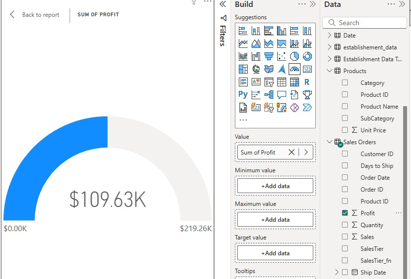

2. **Create & Build Scatter Chart**
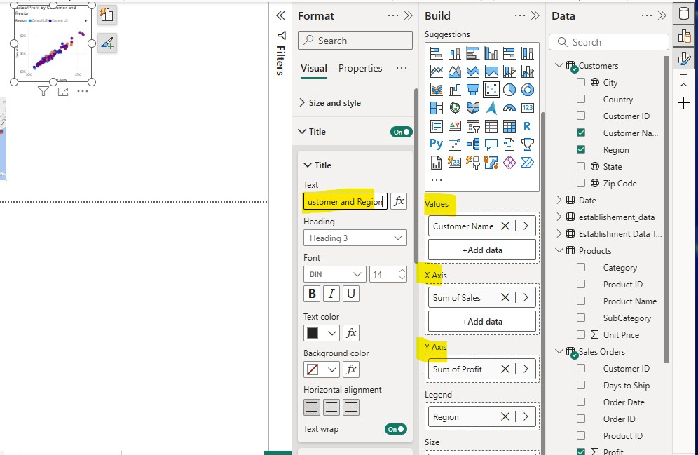  
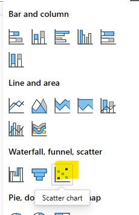

3. **Adjust Bubble Size & Final Graph**
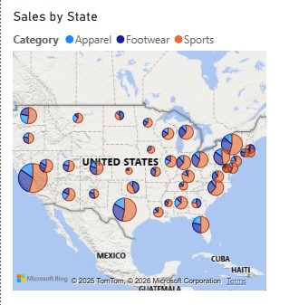  
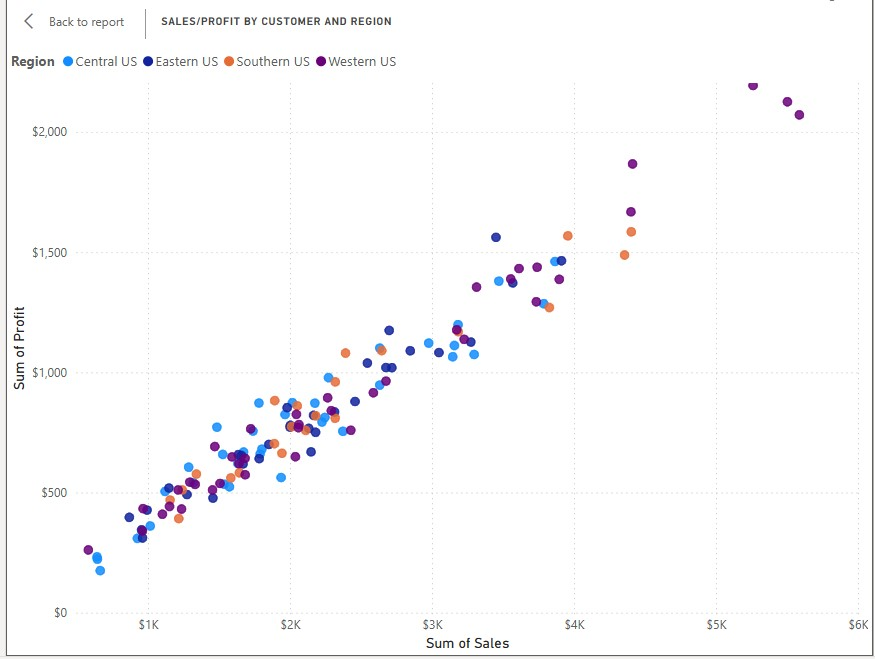

4. **Apply Tooltip Interactivity**
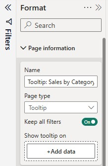  
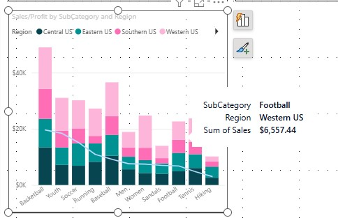  
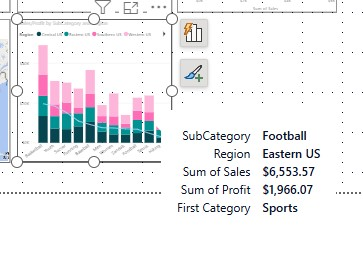  
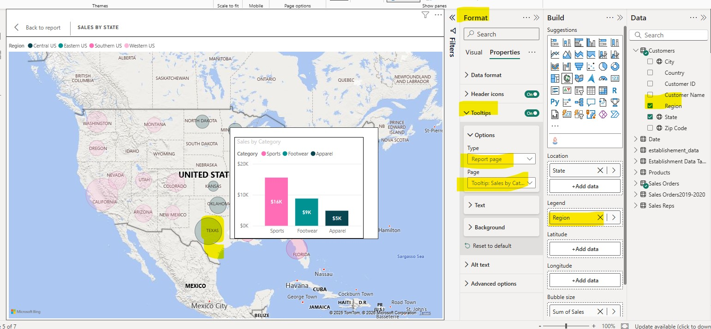

5. **Sort Categories & Profit**
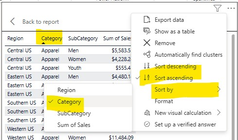  
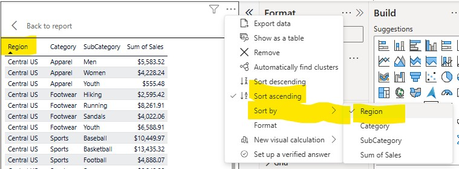  
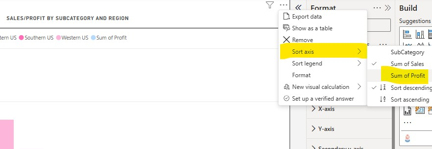  
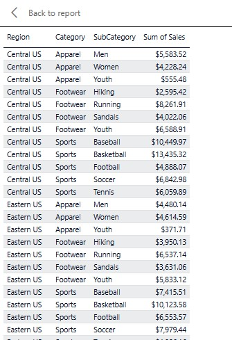  

---

### 2️⃣ Map Visuals & Geospatial Insights
- **Enable Map Feature**  
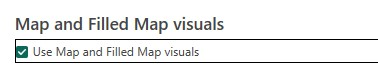  
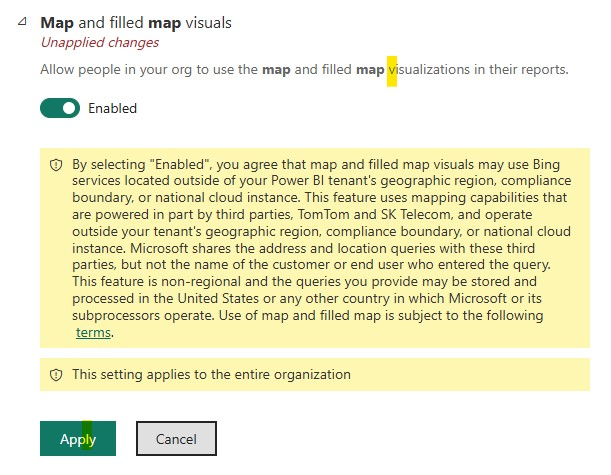  
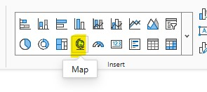  
- **Add Borders & Final Formatting**  
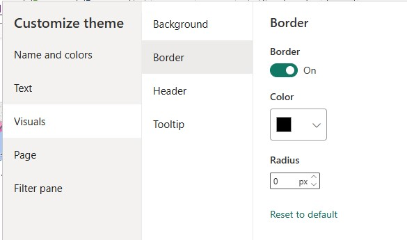 | 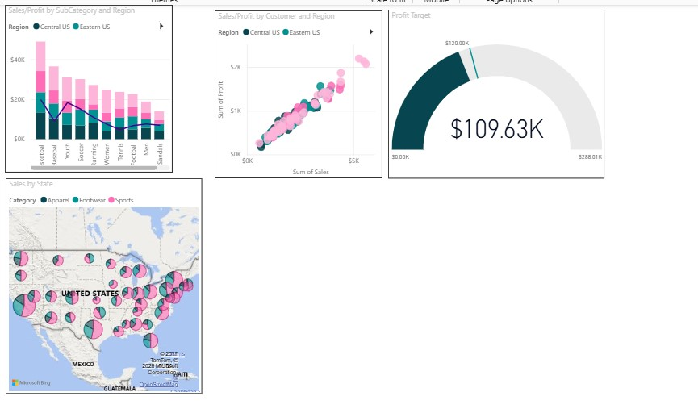  
- **Final Maps**
  
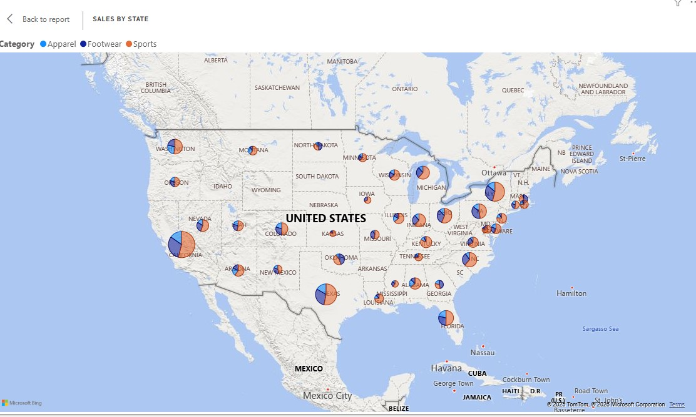  
- **Error Handling**  
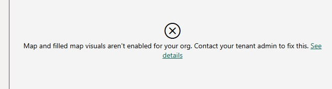

---

### 3️⃣ Line & Stacked Column Charts
- **Line and Clustered Column Construction**
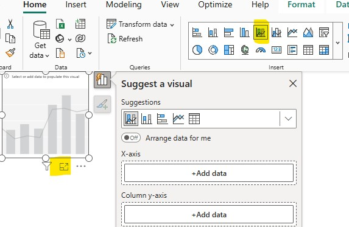  
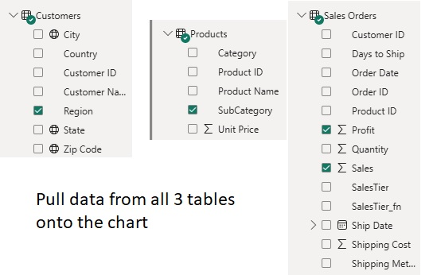  
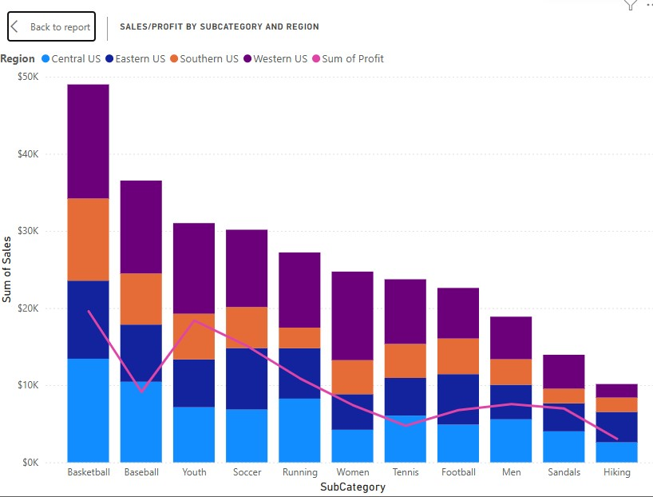  
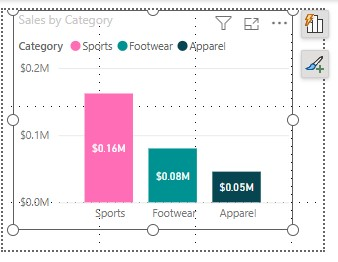

---

### 4️⃣ Gauge & Target Visuals
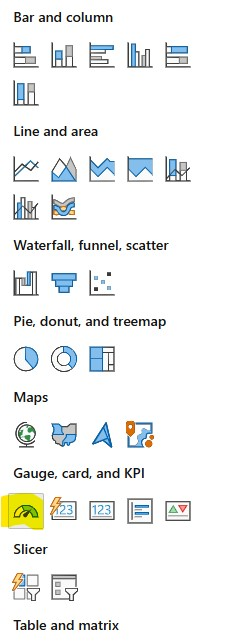  
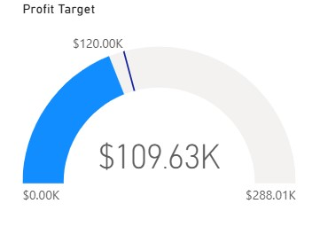  

---

### 5️⃣ Infographics & AppSource Visuals
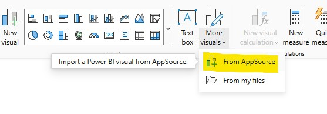  
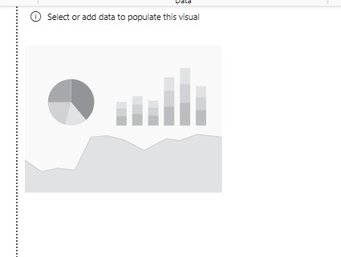  
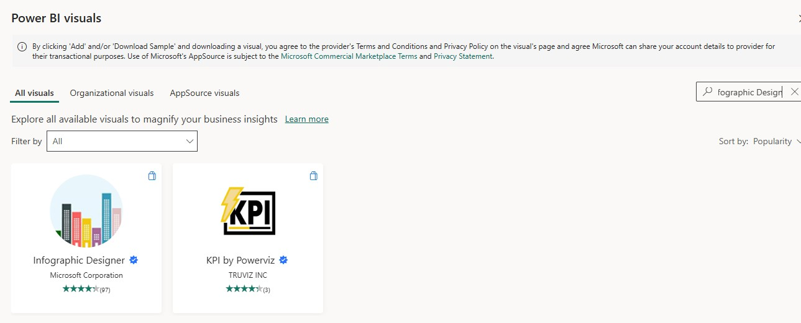  
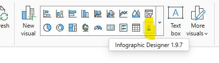  
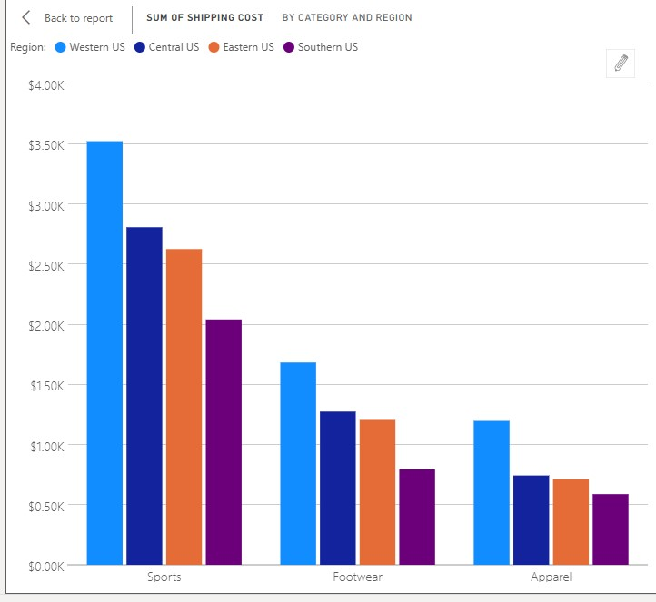  

---

### 6️⃣ Customization & Final Touches
- **Color Palettes & Contrast**
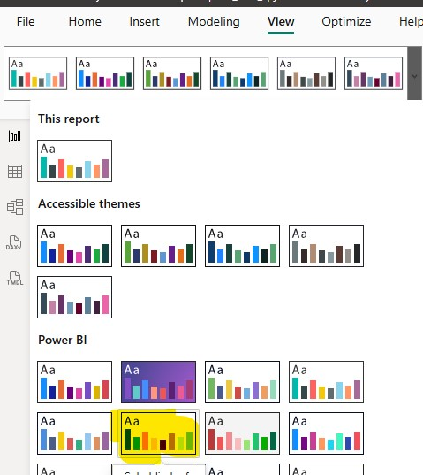  
  
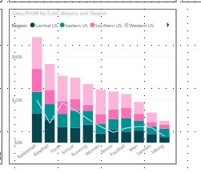

- **Resize, Update Titles & Integration**
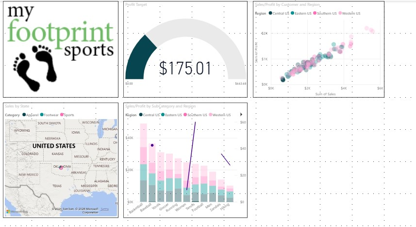  
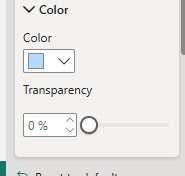  
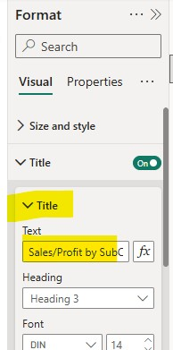  
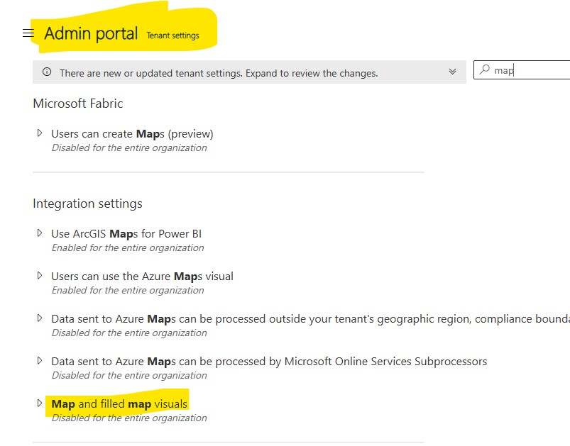

---

### 7️⃣ Final Dashboard Outputs
- **Total by Region, Category, SubCategory**
  
- **Final Shipping Cost by Category & Region**
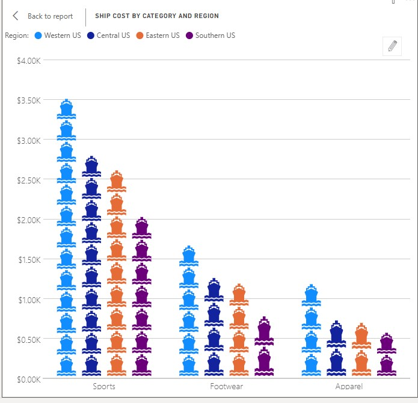  
- **Interactions**
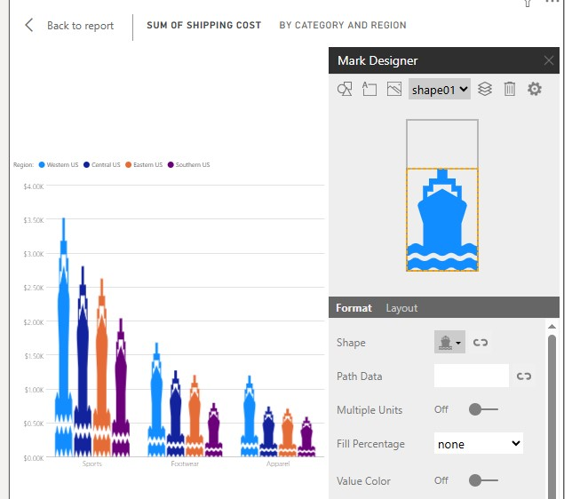  
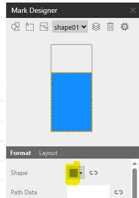  
  

---

## 📄 Published Report
Full walkthrough with explanations and visuals:  

🔗 [Published Google Doc](https://docs.google.com/document/d/e/2PACX-1vRzCm8RpqCNMi6-PjiWiCsDbZQoLWPQd12uR3bcsrMBDfZAxsFJlrqXaGvW04YVC93QRo-EEKDnlW68/pub)  

**Process Overview:**  
1. Validate tables and key fields  
2. Create calculated fields  
3. Format measures  
4. Build base visuals (Sales & Profit combo)  
5. Refine titles, sort orders, and formatting  
6. Add map & tooltip interactivity  
7. Integrate gauges, line/stacked columns, and infographics  
8. Publish and interpret results  

---

## 💡 Key Takeaways
- Visual field placement directly impacts formatting options  
- Power BI’s **Suggested visuals** accelerate exploratory analysis  
- UI updates require adaptability when following older guides  
- Structured documentation enhances portfolio credibility  

---

## 📬 Author
**Marlainna Francis**  
Data Analyst | Business Intelligence | Analytics  

🌐 Portfolio: [yourexodus.github.io/MarlainnaTheAnalyst](https://yourexodus.github.io/MarlainnaTheAnalyst/)  
🐙 GitHub: [github.com/yourexodus](https://github.com/yourexodus)  