# ⚡ Advanced Editor & Custom Functions in M

## 📌 Core Objectives Covered
* **Built Reusable Power Query Custom Functions:** Encapsulated conditional sales tiering logic inside a single, central M function (`fnSalestier`) rather than rewriting rules across multiple queries.
* **Used M Language in Advanced Query Editor:** Hand-coded native M script inside Power Query's Advanced Editor to manage parameter types, conditional logic, and column operations directly.
* **Reduced Repetitive Transformations:** Replaced multi-step inline column calculations across different tables with a single, streamlined function invocation step.
* **Improved Scalability and Maintainability:** Ensured that future business updates (like changing sales threshold amounts) only need to be modified once inside the primary function to update all dependent queries automatically.

---

## 🛠️ Step-by-Step Execution & Breakdown

### 1️⃣ Advanced Editor & Base Code Setup

To review and modify the raw M transformations, open the **View** ribbon tab and select **Advanced Editor** to open the M script window.

Before adding custom logic, inspect the original `let ... in` code structure of the `Sales Orders` query to identify where to insert custom transformations.

Hand-code an inline `Table.AddColumn` step using `if/else` logic to assign "Premium", "High", "Mid", and "Low" sales tiers directly inside the Advanced Editor.
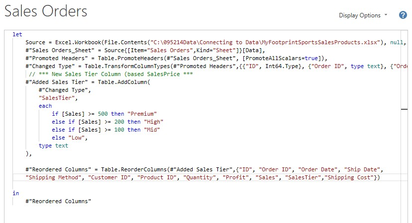

Save and exit the editor to verify that the newly generated `SalesTier` column appears alongside the numeric `Sales` column in the data grid.
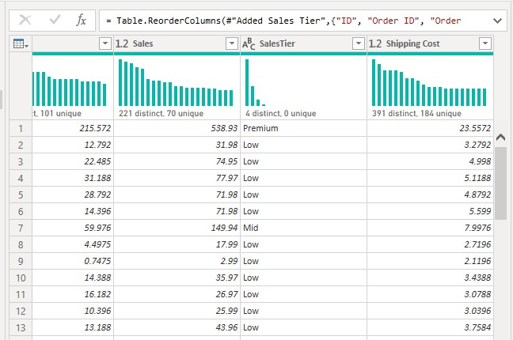

---

### 2️⃣ Custom Function Construction (`fnSalestier`)

To build a central reusable custom function, navigate to **Home** > **New Source** > **Blank Query** to initialize a new query object.
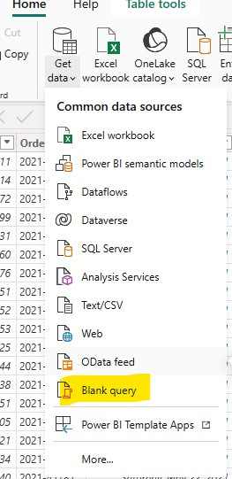

Open the Advanced Editor for the blank query and write the parameter definition `(Sales as nullable number)` along with the conditional M tiering script.
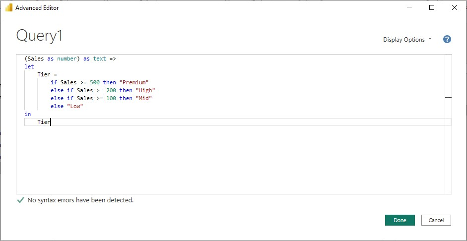

Rename and save the new query object as `fnSalestier` in the left Query Pane for cross-query access.
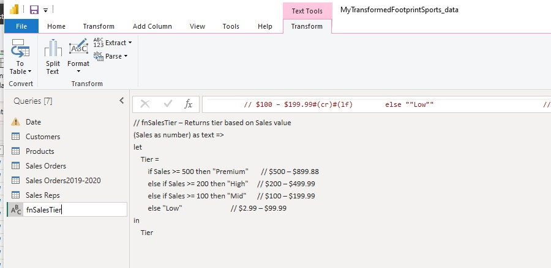

---

### 3️⃣ Function Testing & Invocation

Before applying the custom function across datasets, input static numbers into the parameter input UI to verify that the function returns correct tier strings.
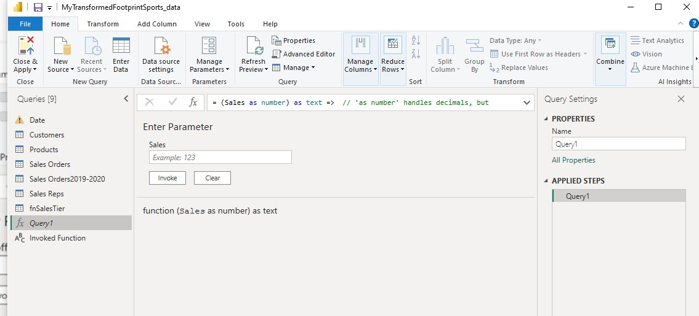

Review the standalone test output screen to confirm the custom function resolves the test values accurately.
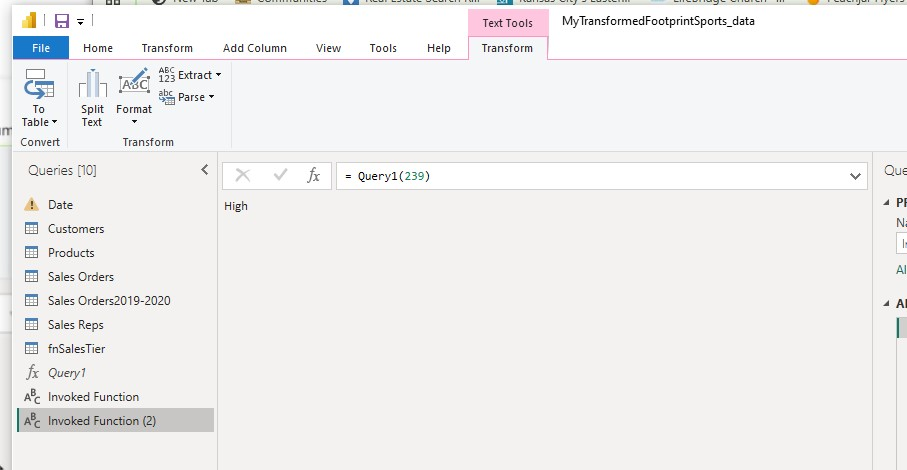

Return to the `Sales Orders` dataset, open the **Add Column** tab, and select **Invoke Custom Function**.
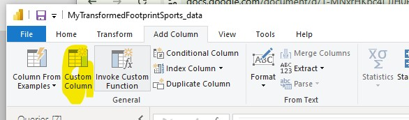

In the Invoke Custom Function dialog box, choose `fnSalestier` from the function dropdown menu.
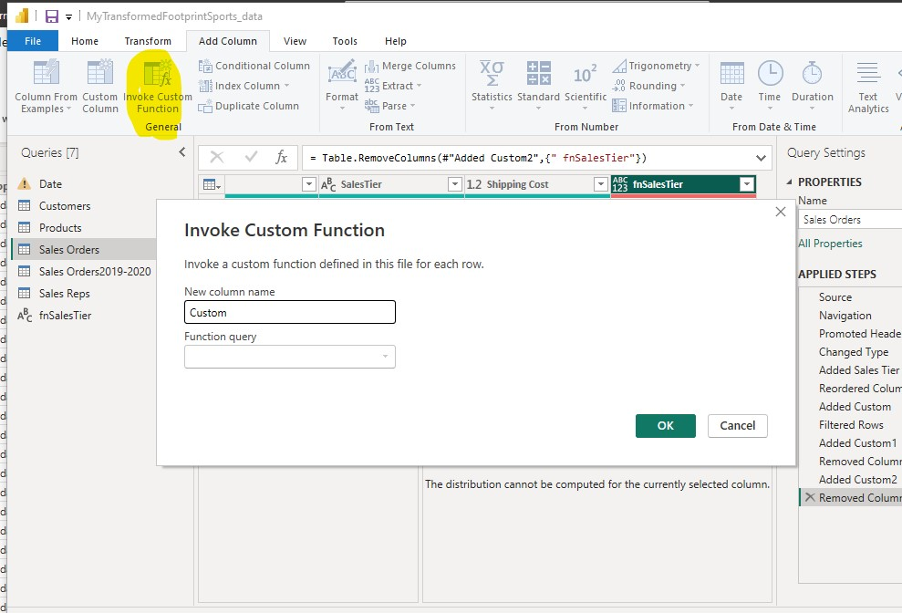

Verify that the expected decimal parameter type matches the data type of the underlying target field.
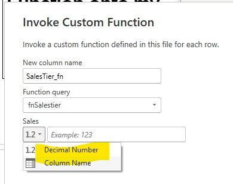

Toggle the input setting from static text entry to **Column Name**, mapping the parameter directly to the `Sales` column.
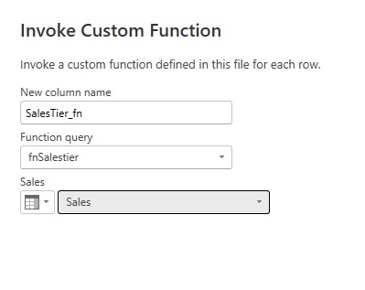

Click **OK** to run the function and create the calculated custom column within the query environment.
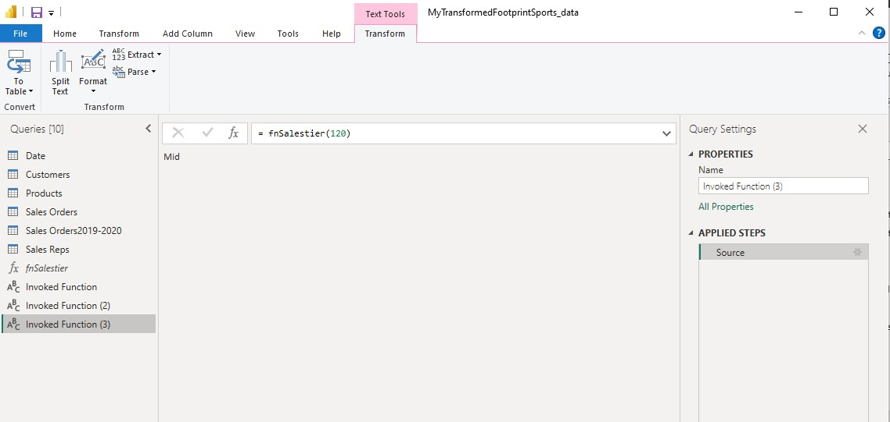

---

### 4️⃣ Output Parity & Cross-Table Scaling

Compare the direct inline calculated column `SalesTier` with the function-generated column `SalesTier_fn` side-by-side to ensure complete data parity.
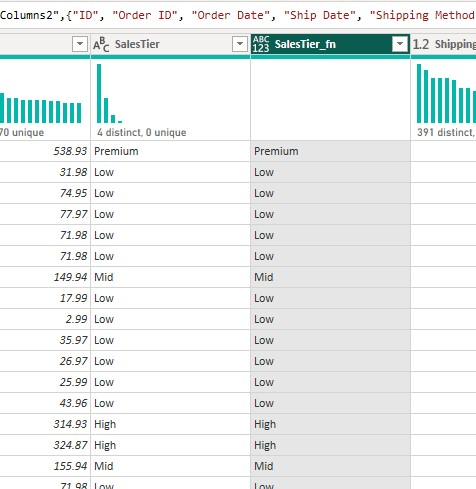

Inspect the finalized query M code script showing both the inline conditional steps and the invoked function steps combined.
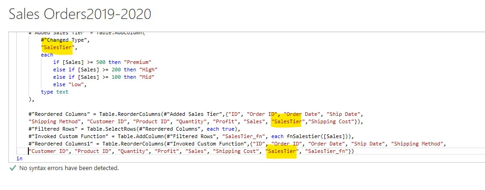

Copy the custom M code block using text editing techniques to easily port transformations across secondary queries.
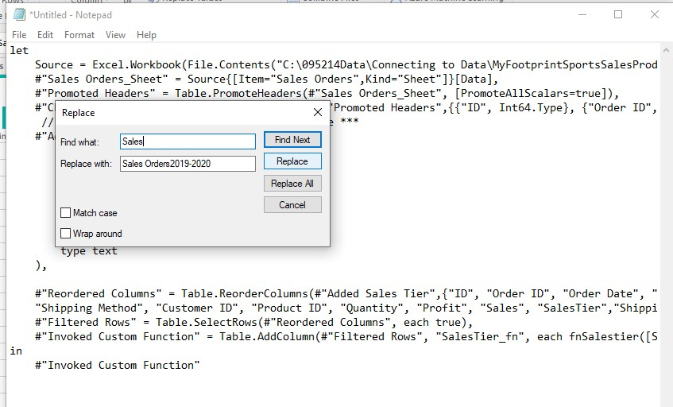

Paste the custom transformation logic directly into the Advanced Editor of secondary historical datasets like `Sales Orders2019-2020`.
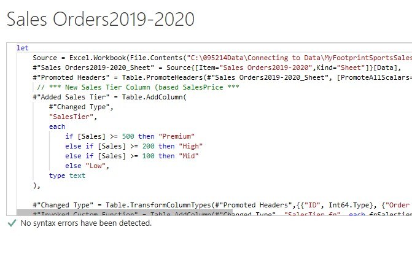

Check the data grid of the secondary table to confirm that the tiered calculations resolved correctly without recreating steps manually.
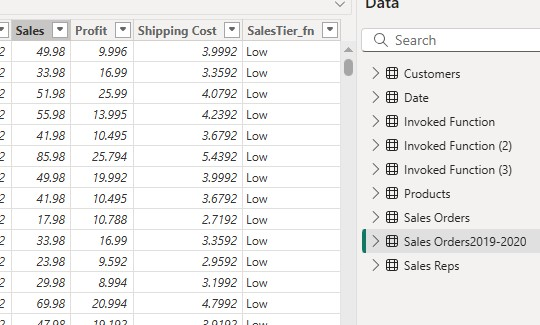

Execute a preview refresh across the Power Query Editor to ensure all table dependencies evaluate cleanly.
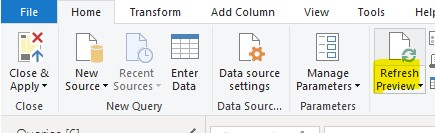

---

### 5️⃣ Data View & Model Finalization

Switch to the Power BI Desktop Data View to update the `Sales` column formatting to **Decimal Number** with 2 decimal places.
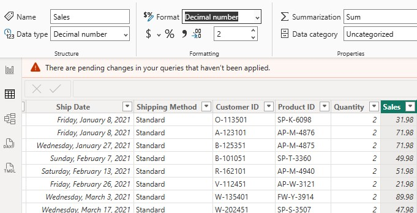

Verify that the newly created custom function column appears under the correct table within the Power BI Desktop Fields pane.
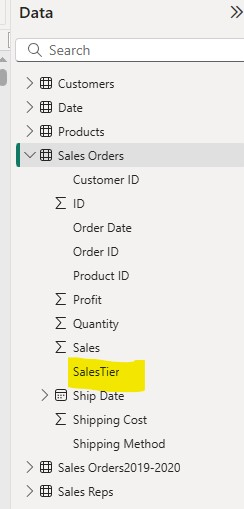

Confirm that the calculated attribute is fully loaded into the report dataset view and ready for visual analysis.
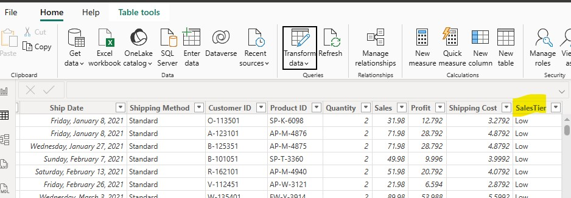

Perform a final validation check across secondary related tables to ensure calculated attributes integrate cleanly throughout the data model.
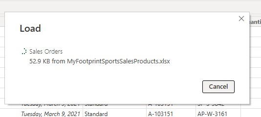
