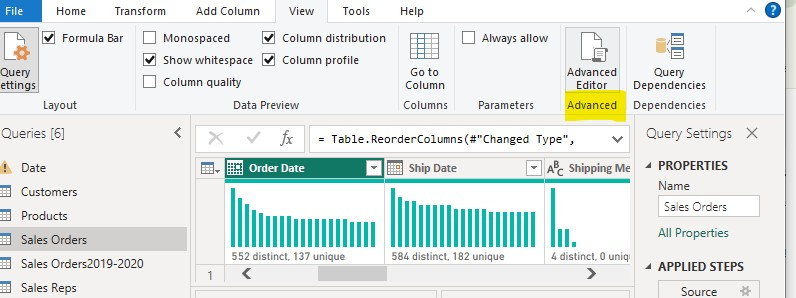
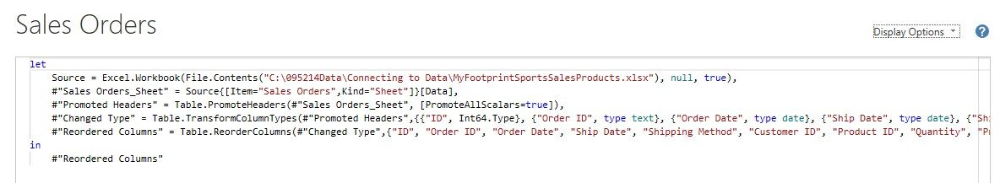

# ⚡ Advanced Editor & Custom Functions in M (Step 3)

## 📌 Overview
This step covers modifying dataset queries using Power Query's **Advanced Editor** and building reusable **Custom M Functions**. By moving repetitive transformation logic (such as conditional sales tiering) into dedicated custom functions using the M language, query steps are streamlined, code duplication is minimized, and overall data model maintainability and scalability are significantly improved.

---

## 🛠️ Step-by-Step Advanced Editor & Custom Function Implementation

### 1️⃣ Accessing the Advanced Editor & Initial Query State
- Navigated to the **View** tab in Power Query Editor and clicked **Advanced Editor** to inspect the underlying M code script for `Sales Orders`.
- Evaluated the baseline `let ... in` expression structure prior to applying manual code edits.

  
*Figure 3.1: Accessing the Advanced Editor from the View ribbon.*

  
*Figure 3.2: Original M code structure before custom logic insertion.*

---

### 2️⃣ Editing M Language Code in Advanced Editor
- Modified the M script directly to insert conditional classification logic (`#"Added Sales Tier"`):
  ```powerquery
  #"Added Sales Tier" = Table.AddColumn(
      #"Changed Type",
      "SalesTier",
      each 
          if [Sales] >= 500 then "Premium"
          else if [Sales] >= 200 then "High"
          else if [Sales] >= 100 then "Mid"
          else "Low",
      type text
  )
